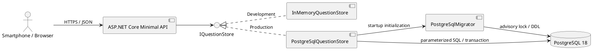
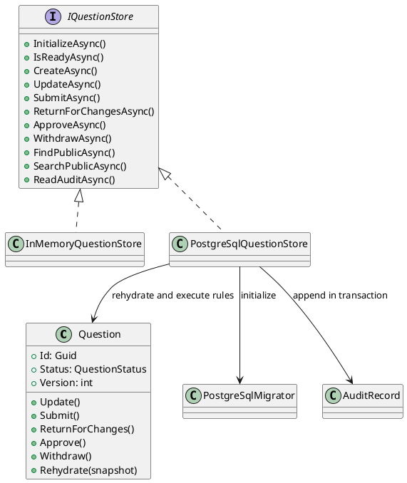
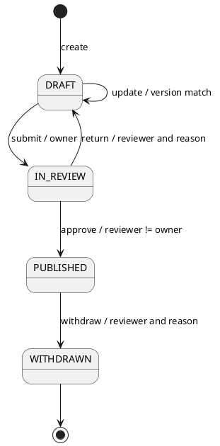
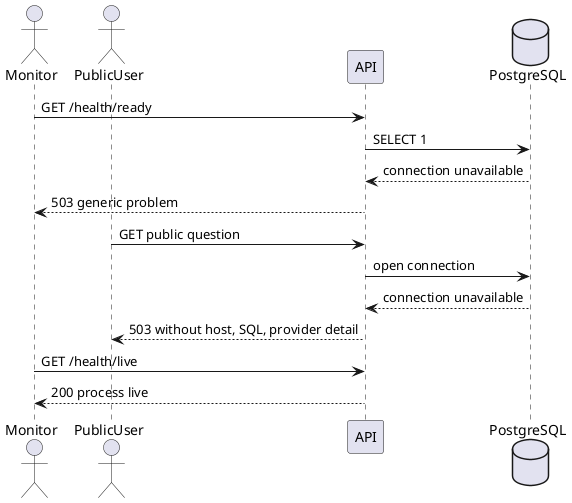

# QF-UML-MVS01-002 PostgreSQL永続化 UML仕様書

- Version: 0.2
- 日付: 2026-08-16
- 対象: MVS-01 Stage 2

以下は実装と同じ変更で維持するPlantUML原本である。図に未実装の東京・石狩DRを混在させず、今回検証できる境界だけを表す。

## UML-CMP-MVS01-002 コンポーネント



## UML-CLS-MVS01-002 永続化クラス



## UML-SM-MVS01-001 問いの状態機械（継続）



未定義遷移は409、所有者違反と自己承認は403、古い版は409とする。状態判断はDBではなく `Question` 集約が行う。

## UML-SEQ-MVS01-005 再起動保持（TC-026）

```plantuml
@startuml
actor Reviewer
participant "API instance A" as ApiA
database PostgreSQL as Db
participant "API instance B" as ApiB
actor PublicUser

Reviewer -> ApiA : approve(questionId, idempotencyKey)
ApiA -> Db : BEGIN; lock row
ApiA -> Db : UPDATE question; INSERT audit; INSERT idempotency
ApiA -> Db : COMMIT
ApiA --> Reviewer : 200 PUBLISHED
destroy ApiA
create ApiB
ApiB -> Db : migrate once; SELECT published question
Db --> ApiB : persisted row
PublicUser -> ApiB : GET public question
ApiB --> PublicUser : 200 public DTO
@enduml
```

## UML-SEQ-MVS01-006 DB障害（TC-027）



## 配置上の次段階境界（Stage 3で更新）

Stage 2は単一DBでの再起動保持を確認する。Stage 3の調査で、現行CRRが石狩第1サイトから東京第1サイトへの片方向であることを確認したため、将来記述の役割を石狩primary・東京recoveryへ変更した。暗号化バックアップ、隔離復元、RPO/RTOは `uml-stage3.md` とDR TC-030〜033を正とする。この文書のTC-026をリージョン災害試験として扱ってはならない。
