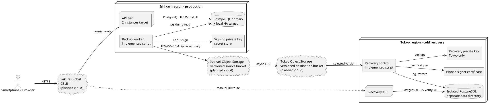
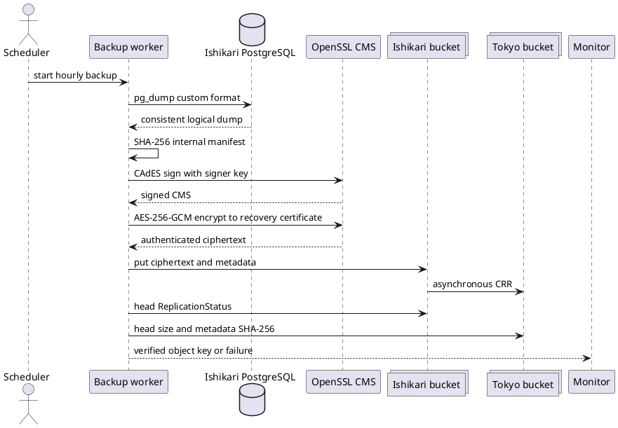
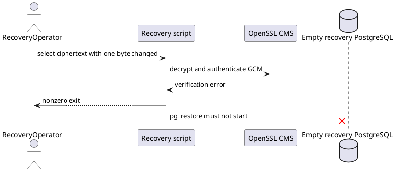
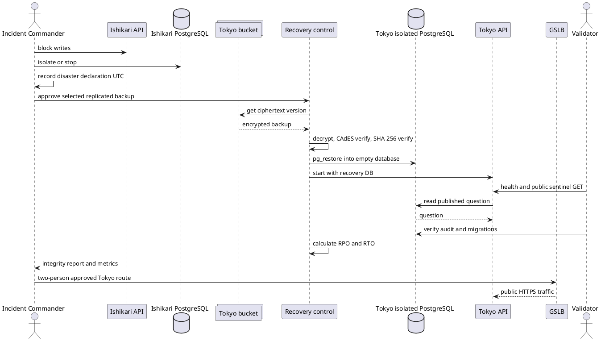
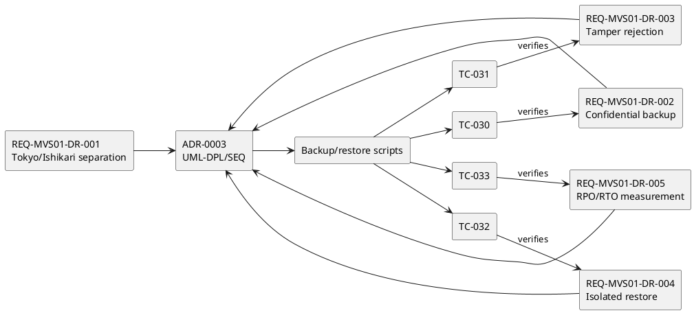

# QF-UML-MVS01-003 災害復旧 UML仕様書

- Version: 0.3
- 日付: 2026-08-16
- 対象: MVS-01 Stage 3

以下は実装、要求、試験と同じ変更で維持するPlantUML原本である。`implemented` は本リポジトリで自動検証済み、`planned cloud` はさくら実環境での構築・訓練待ちを表す。

## UML-DPL-MVS01-003 石狩本番・東京復旧配置

配置制約:

- 復旧秘密鍵を石狩へ配置しない。
- DB portをInternetへ公開しない。APIまたは限定したbackup/recovery主体だけを許可する。
- 石狩と東京を同時にwrite primaryにしない。
- CRR到達確認前のbackupを「東京復旧可能」と記録しない。
- GSLB切替は旧石狩write経路の隔離と二者承認後に行う。

## UML-SEQ-MVS01-007 暗号化バックアップ（TC-030）

事後条件:

- 確定objectは`.p7m`暗号文であり、DB本文のsentinelを平文検索できない。
- 内部manifestとdumpは暗号化範囲内にあり、metadataだけでは復元を信頼しない。
- CRRは非同期なので、生成完了、石狩upload、東京到達を別々に監視する。

## UML-SEQ-MVS01-008 改ざん拒否（TC-031）

GCM認証を通過しても、CAdES署名、固定した署名者証明書、internal dump SHA-256を順に検証し、どれか一つでも失敗した時点でDB操作前に終了する。

## UML-SEQ-MVS01-009 隔離復元とRPO/RTO（TC-032、TC-033）

RPOは`disasterDeclaredAt - snapshotStartedAt`、RTOは`recoveryAcceptedAt - disasterDeclaredAt`とする。ローカル自動試験ではGSLB切替を実行せず、API/DB整合性確認時点までをRTOとして計測する。実クラウド訓練ではGSLB切替と外部smoke test完了までを含める。

## UML-TST-MVS01-003 V字対応

Stage 3時点の完了条件は、要求ID、ADR、UML ID、script、TC-030〜033、復旧証跡の対応が切れていないこと、かつ当時のローカル全37件が合格することだった。Stage 5追加後の現行gateは`uml-stage5.md`と`verification-result.md`に記録した全52件である。クラウド運用開始条件はこれに加え、実バケットCRRと東京復旧訓練の合格を必要とする。
