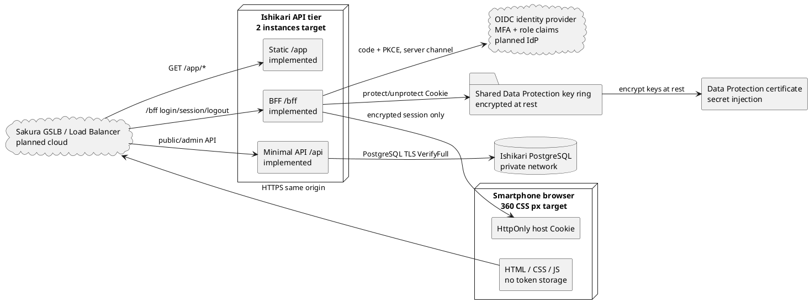
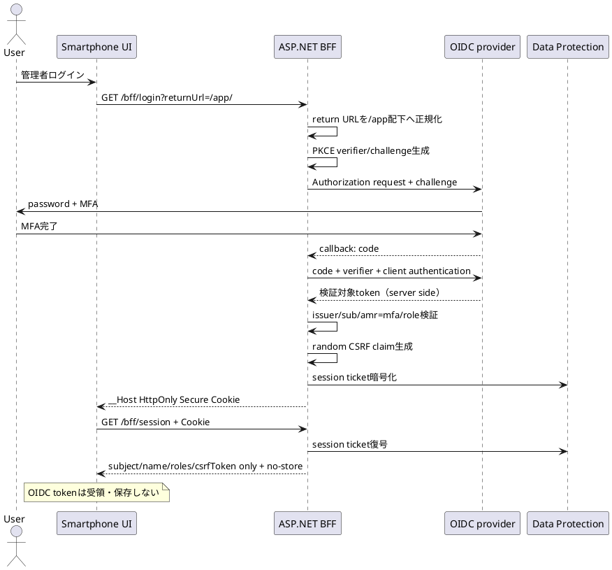
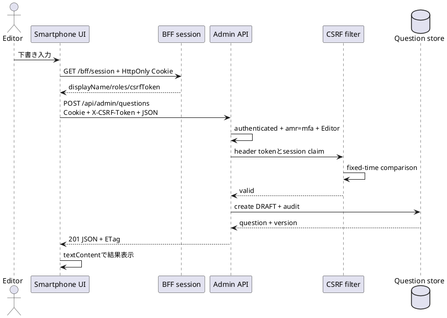
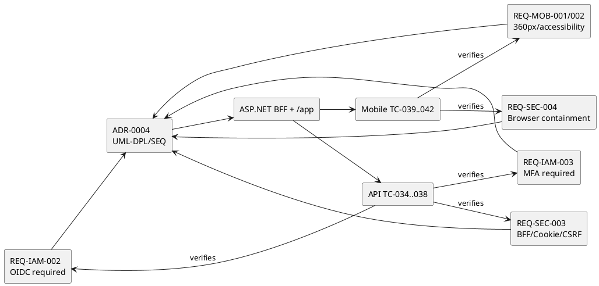

# QF-UML-MVS01-004 スマートフォン/BFF UML仕様書

- Version: 0.4
- 日付: 2026-08-16
- 対象: MVS-01 Stage 4

以下は実装、要求、試験と同じ変更で維持するPlantUML原本である。`implemented`は本リポジトリで自動検証済み、`planned IdP/cloud`は実契約環境での接続・訓練待ちを表す。

## UML-DPL-MVS01-004 スマートフォン・BFF・認証配置

配置制約:

- access token、refresh token、client secretをスマートフォンへ配らない。
- UI、BFF、APIは同一originとし、CORSを不要にする。
- API instance間でkey ringを共有し、key ringはcertificateで暗号化する。
- PostgreSQL、key ring、PFXをInternetへ公開しない。
- Load BalancerでTLS終端する場合は、既知proxyだけを信頼するforwarded headers設定を本番化前に追加する。

## UML-SEQ-MVS01-010 OIDCログインとBFF session（TC-034〜038）

異常系:

- ProductionでOIDC無効、AuthorityがHTTP、client secret欠落なら起動を拒否する。
- `sub`がないtoken、`amr=mfa`がない管理要求、必要roleがない操作を拒否する。
- 外部return URLは`/app/`へ置き換える。

## UML-SEQ-MVS01-011 CSRF付き下書き作成（TC-036、037、041、042）

拒否条件:

- Cookie、MFA claim、Editor role、CSRF tokenのいずれかがなければ保存しない。
- 本文をHTMLとして挿入せず、公開検索結果も`textContent`で描画する。
- BFF/admin/app shellを共有cacheへ保存させない。

## UML-TST-MVS01-004 V字対応

Stage 4時点のローカル完了条件は、要求ID、ADR、UML ID、BFF/UI実装、TC-034〜042の対応が切れておらず、当時の全46件が合格することだった。Stage 5追加後の現行gateは`uml-stage5.md`と`verification-result.md`に記録した全52件である。Production運用開始には、実IdP/MFA、実スマートフォン、さくらの外部HTTPS経路、proxy trust、鍵保管を使う受入試験を追加で必要とする。
