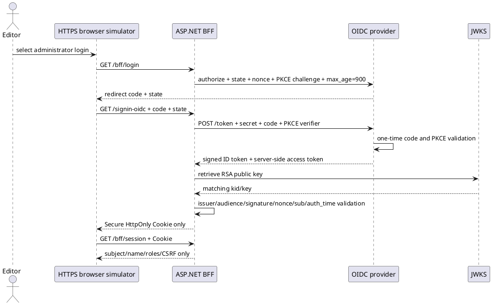
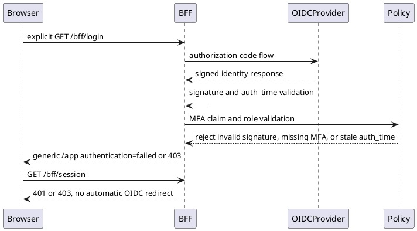
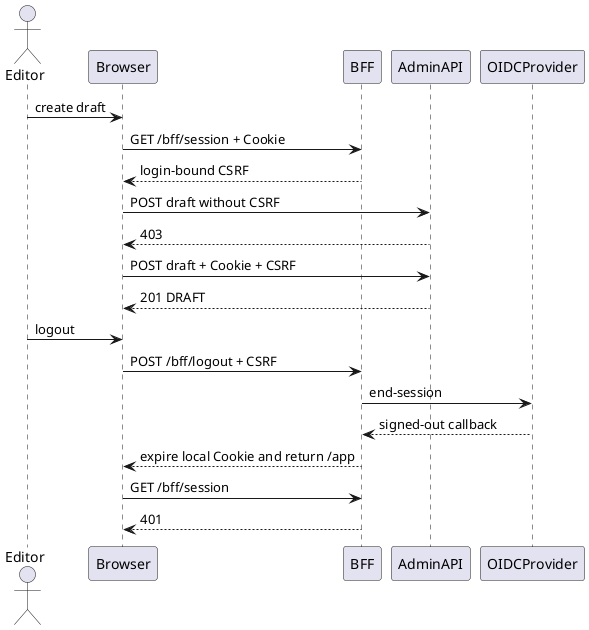
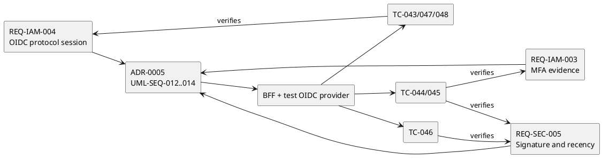

# QF-UML-MVS01-005 OIDC実プロトコル UML仕様書

- Version: 0.5
- 日付: 2026-08-16
- 対象: MVS-01 Stage 5

以下は実装、要求、試験と同じ変更で維持するPlantUML原本である。試験IdPはtest assembly内だけに存在し、Production publishへ含めない。

## UML-SEQ-MVS01-012 OIDC code + PKCE実往復（TC-043）

事後条件:

- access token、ID token、client secret、PKCE verifierはbrowser CookieまたはBFF session JSONへ入らない。
- `roles=Editor`と`amr=mfa`を別々に検査する。
- `auth_time`は現在から15分＋clock skew 1分以内とする。

## UML-SEQ-MVS01-013 安全側拒否（TC-044、045、048）

拒否理由のtoken内容、鍵情報、exceptionをbrowserへ出さない。signature/auth_time不正はsession Cookieを作成せず、MFA claim欠落は認証済みでも管理authorizationを403にする。

## UML-SEQ-MVS01-014 CSRF更新とlogout（TC-046、047）

## UML-TST-MVS01-005 V字対応

Stage 5ローカル完了条件は、Stage 4の全46件を維持し、OIDC E2E TC-043〜048を加えた全52件が合格することである。実IdP gateは`entra-id-setup.md`のENTRA-AT-01〜10を別途満たす必要がある。

