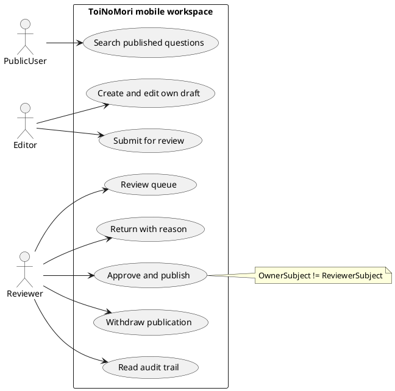
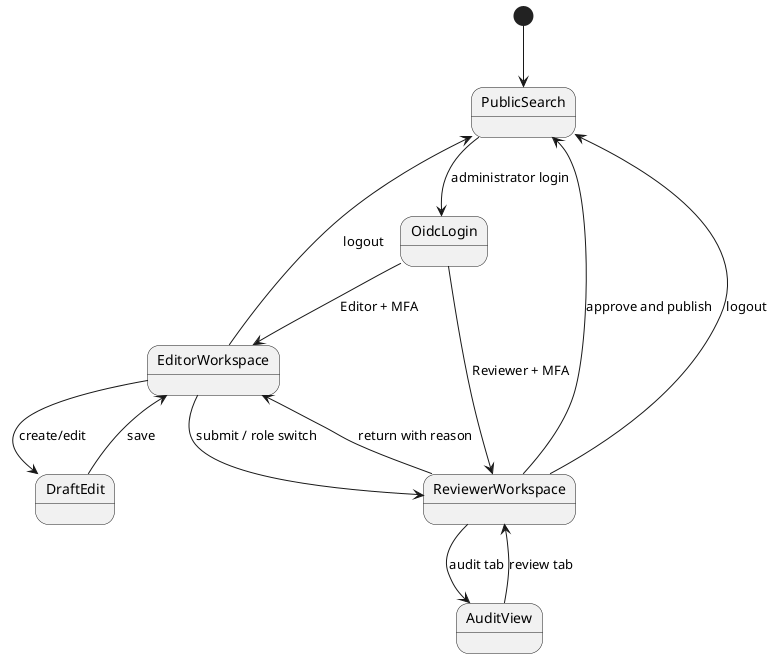
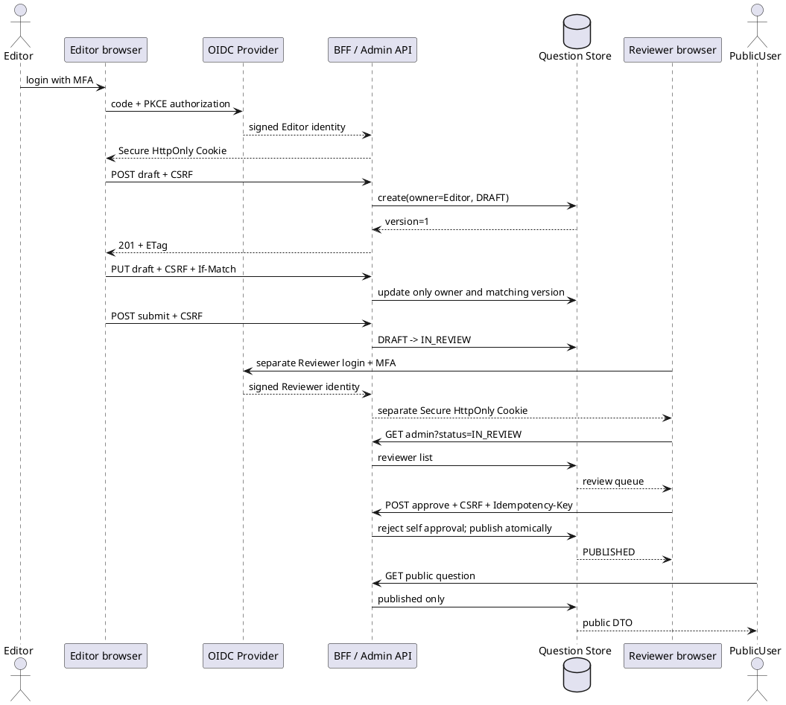
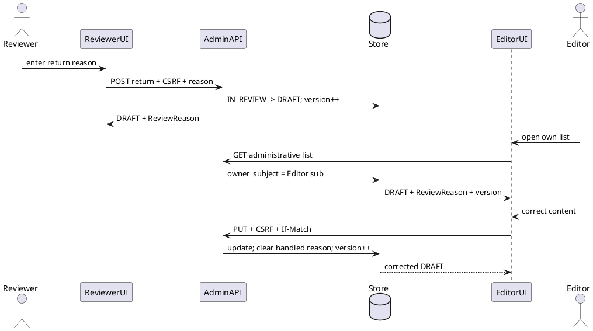
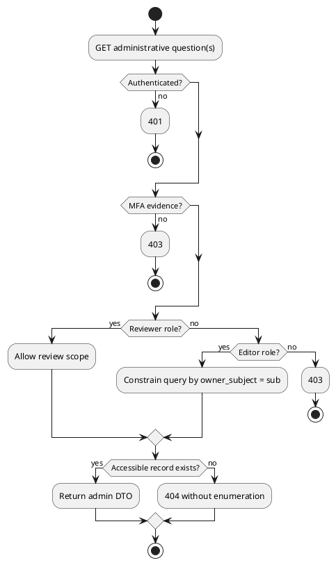
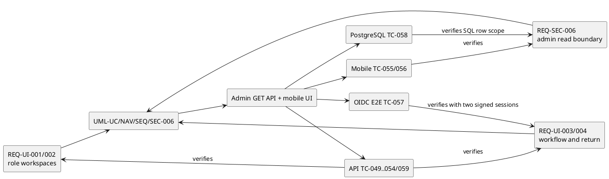

# QF-UML-MVS01-006 Stage 6 業務フロー UML仕様書

- Version: 0.6
- 日付: 2026-08-16
- 対象: スマートフォン編集・審査・公開ワークスペース

以下のPlantUML原本を要求、実装、試験と同じ変更で維持する。

## UML-UC-MVS01-006 利用者と業務

## UML-NAV-MVS01-006 画面遷移

## UML-SEQ-MVS01-015 OIDC二利用者の公開完結（TC-052、057）

## UML-SEQ-MVS01-016 差し戻しと再編集（TC-053）

## UML-SEC-MVS01-006 管理閲覧境界

## UML-TST-MVS01-006 V字対応

Stage 6ローカル主要層の完了条件はDomain 9、API 32、Mobile 6、OIDC E2E 7の計54件を同一版で合格させること。PostgreSQL TC-024〜027/058とDR TC-030〜033を含む全層63件、実browser engine、実IdP、実クラウドは別gateとする。
