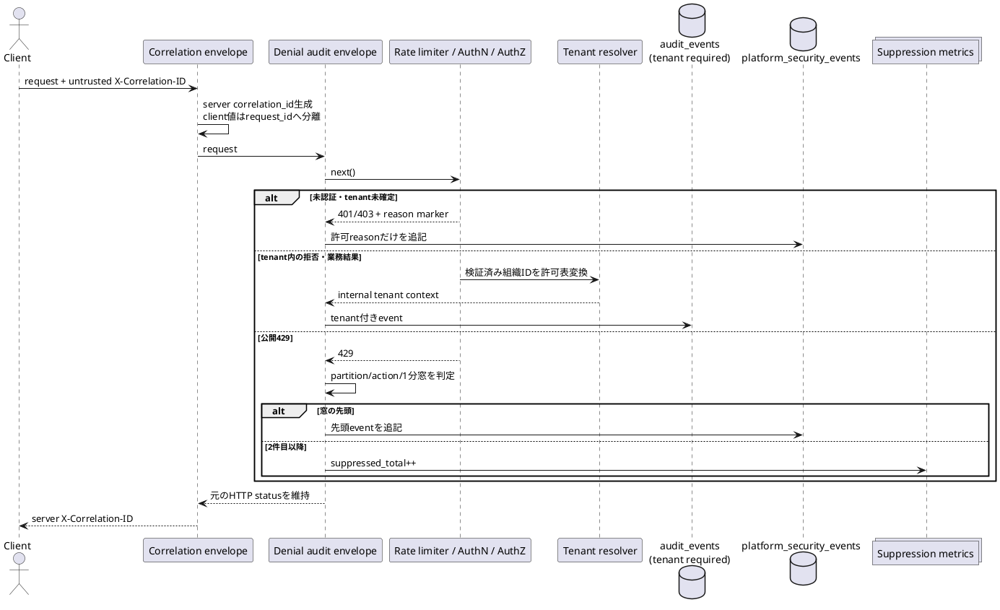
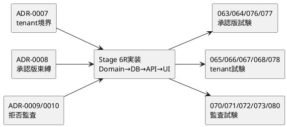

# Stage 6R-1 UML補足

## UML-SEQ-MVS01-017 テナント未確定拒否と429抑制

```plantuml
@startuml
actor Client
participant "Correlation envelope" as Correlation
participant "Denial audit envelope" as Envelope
participant "Rate limiter / AuthN / AuthZ" as Guard
participant "Tenant resolver" as Tenant
database "audit_events\n(tenant required)" as TenantAudit
database "platform_security_events" as PlatformAudit
collections "Suppression metrics" as Metrics

Client -> Correlation: request + untrusted X-Correlation-ID
Correlation -> Correlation: server correlation_id生成\nclient値はrequest_idへ分離
Correlation -> Envelope: request
Envelope -> Guard: next()
alt 未認証・tenant未確定
  Guard --> Envelope: 401/403 + reason marker
  Envelope -> PlatformAudit: 許可reasonだけを追記
else tenant内の拒否・業務結果
  Guard -> Tenant: 検証済み組織IDを許可表変換
  Tenant --> Envelope: internal tenant context
  Envelope -> TenantAudit: tenant付きevent
else 公開429
  Guard --> Envelope: 429
  Envelope -> Envelope: partition/action/1分窓を判定
  alt 窓の先頭
    Envelope -> PlatformAudit: 先頭eventを追記
  else 2件目以降
    Envelope -> Metrics: suppressed_total++
  end
end
Envelope --> Correlation: 元のHTTP statusを維持
Correlation --> Client: server X-Correlation-ID
@enduml
```

## UML-TST-MVS01-007 V字対応

```plantuml
@startuml
left to right direction
rectangle "ADR-0007\ntenant境界" as A7
rectangle "ADR-0008\n承認版束縛" as A8
rectangle "ADR-0009/0010\n拒否監査" as A9
rectangle "Stage 6R実装\nDomain→DB→API→UI" as Impl
rectangle "063/064/076/077\n承認版試験" as T8
rectangle "065/066/067/068/078\ntenant試験" as T7
rectangle "070/071/072/073/080\n監査試験" as T9
A7 --> Impl
A8 --> Impl
A9 --> Impl
Impl --> T7
Impl --> T8
Impl --> T9
@enduml
```

このUMLは設計境界を表す。Stage 6R-1では右側試験を赤で固定し、製品実装はまだ追加しない。
