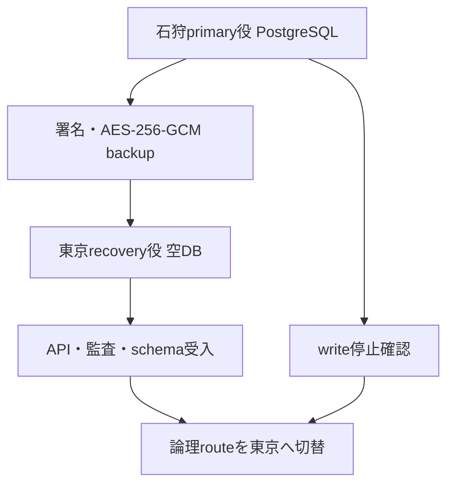
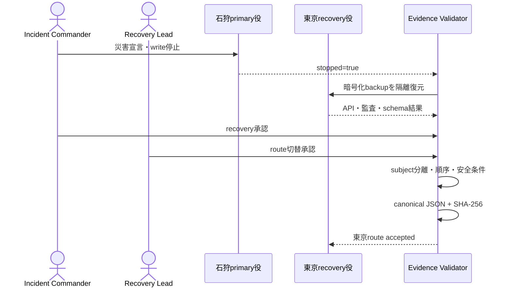
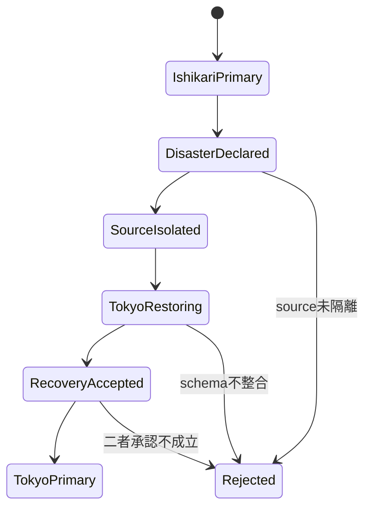

# Stage 6R-10 東京–石狩DR切替・復旧証跡 UML仕様書

- 文書ID: QF-UML-MVS01-6R10
- 版: Version 0.1
- 日付: 2026-08-25
- 対応仕様: QF-ST6R10-MVS01-001

## UML-DPL-MVS01-6R10-001 native二重クラスタ

これはローカルで別data directoryと別portを使うnative配置であり、物理的な石狩・東京リージョンではない。

## UML-SEQ-MVS01-6R10-001 切替・証跡封印

## UML-SM-MVS01-6R10-001 DR状態

## UML-TST-MVS01-6R10-001 V字対応

| 左側設計 | 右側試験 |
|---|---|
| source write先行隔離 | TC-ACC-MVS01-078-DR |
| 異subject二者承認 | TC-ACC-MVS01-078-DR |
| migration 005・複合FK・platform監査復元 | TC-ACC-MVS01-078-DR |
| 切替時系列fail-closed | TC-ACC-MVS01-078-DR |
| canonical artifact SHA-256封印 | TC-ACC-MVS01-078-DR |
| exact-count全体回帰 | Stage 6R-10非root native 85/85 gate |
