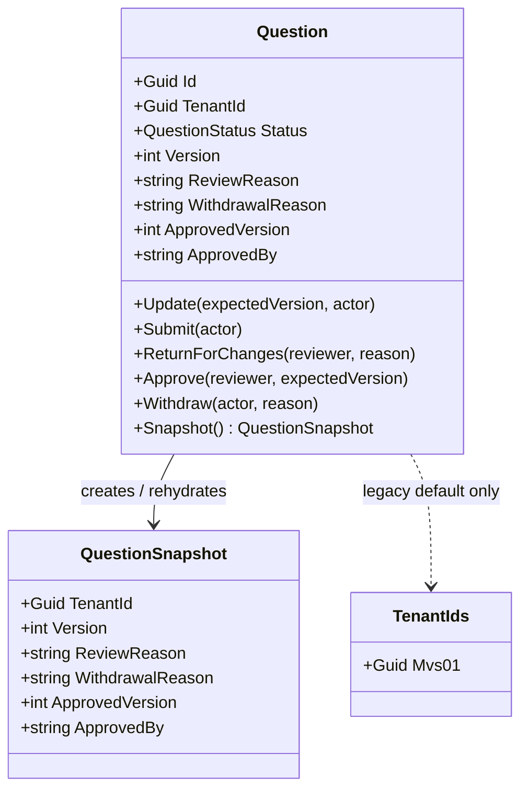
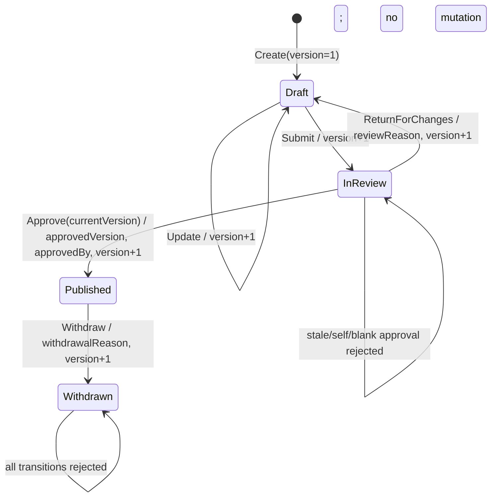
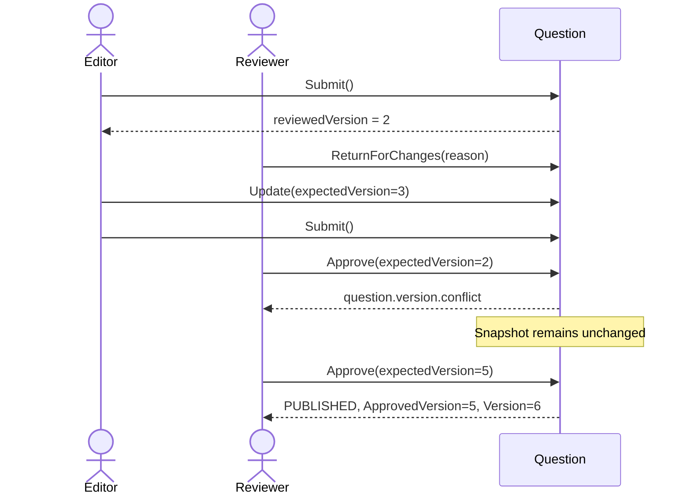
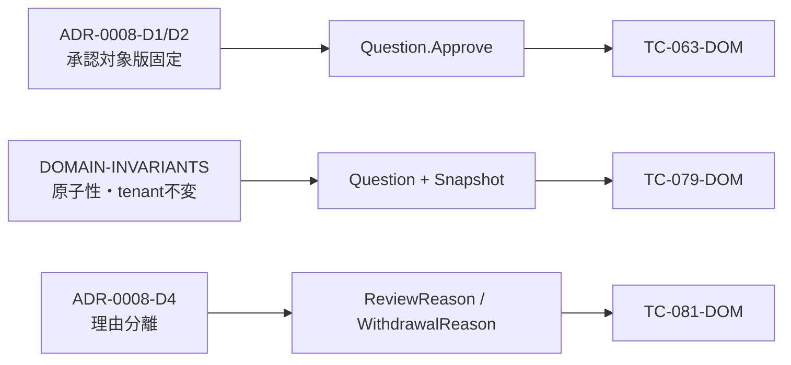

# QF-UML-MVS01-6R2 Domain層 UML仕様書 Version 0.1

## クラス図

```mermaid
classDiagram
    class Question {
        +Guid Id
        +Guid TenantId
        +QuestionStatus Status
        +int Version
        +string ReviewReason
        +string WithdrawalReason
        +int ApprovedVersion
        +string ApprovedBy
        +Update(expectedVersion, actor)
        +Submit(actor)
        +ReturnForChanges(reviewer, reason)
        +Approve(reviewer, expectedVersion)
        +Withdraw(actor, reason)
        +Snapshot() QuestionSnapshot
    }
    class QuestionSnapshot {
        +Guid TenantId
        +int Version
        +string ReviewReason
        +string WithdrawalReason
        +int ApprovedVersion
        +string ApprovedBy
    }
    class TenantIds {
        +Guid Mvs01
    }
    Question --> QuestionSnapshot : creates / rehydrates
    Question ..> TenantIds : legacy default only
```

`TenantIds.Mvs01`は移行用の既定値であり、認証・認可・RLSによるテナント分離を表さない。

## 状態機械

```mermaid
stateDiagram-v2
    [*] --> Draft : Create(version=1)
    Draft --> Draft : Update / version+1
    Draft --> InReview : Submit / version+1
    InReview --> Draft : ReturnForChanges / reviewReason, version+1
    InReview --> Published : Approve(currentVersion) / approvedVersion, approvedBy, version+1
    Published --> Withdrawn : Withdraw / withdrawalReason, version+1
    InReview --> InReview : stale/self/blank approval rejected; no mutation
    Withdrawn --> Withdrawn : all transitions rejected; no mutation
```

## 古い承認版を拒否するシーケンス

```mermaid
sequenceDiagram
    actor Editor
    actor Reviewer
    participant Q as Question
    Editor->>Q: Submit()
    Q-->>Editor: reviewedVersion = 2
    Reviewer->>Q: ReturnForChanges(reason)
    Editor->>Q: Update(expectedVersion=3)
    Editor->>Q: Submit()
    Reviewer->>Q: Approve(expectedVersion=2)
    Q-->>Reviewer: question.version.conflict
    Note over Q: Snapshot remains unchanged
    Reviewer->>Q: Approve(expectedVersion=5)
    Q-->>Reviewer: PUBLISHED, ApprovedVersion=5, Version=6
```

## V字対応

```mermaid
flowchart LR
    A[ADR-0008-D1/D2<br/>承認対象版固定] --> I1[Question.Approve]
    I1 --> T1[TC-063-DOM]
    B[DOMAIN-INVARIANTS<br/>原子性・tenant不変] --> I2[Question + Snapshot]
    I2 --> T2[TC-079-DOM]
    C[ADR-0008-D4<br/>理由分離] --> I3[ReviewReason / WithdrawalReason]
    I3 --> T3[TC-081-DOM]
```
