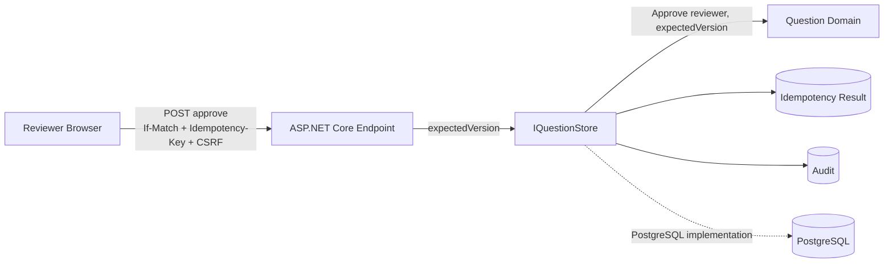
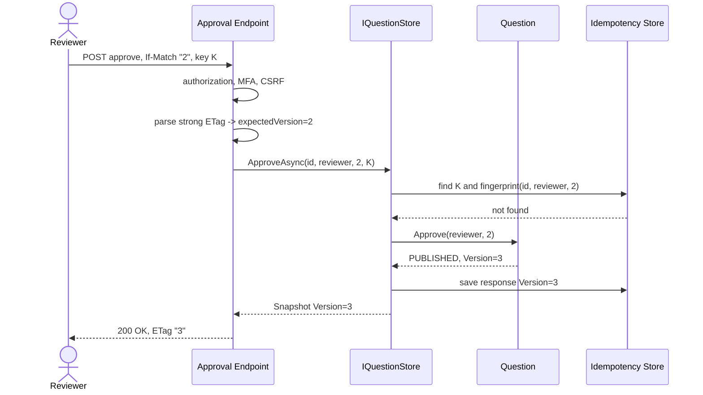
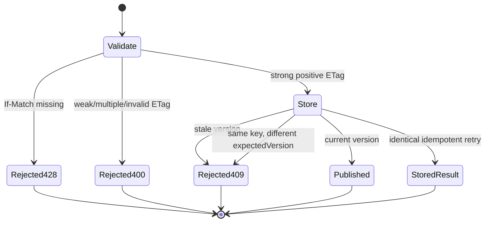
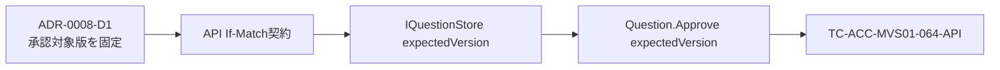

# QF-UML-MVS01-6R3 承認API UML仕様書 Version 0.1

## コンポーネント図

```mermaid
flowchart LR
    R[Reviewer Browser] -->|POST approve<br/>If-Match + Idempotency-Key + CSRF| A[ASP.NET Core Endpoint]
    A -->|expectedVersion| S[IQuestionStore]
    S -->|Approve reviewer, expectedVersion| D[Question Domain]
    S --> I[(Idempotency Result)]
    S --> U[(Audit)]
    S -. PostgreSQL implementation .-> P[(PostgreSQL)]
```

## 承認シーケンス

```mermaid
sequenceDiagram
    actor Reviewer
    participant API as Approval Endpoint
    participant Store as IQuestionStore
    participant Domain as Question
    participant Idem as Idempotency Store

    Reviewer->>API: POST approve, If-Match "2", key K
    API->>API: authorization, MFA, CSRF
    API->>API: parse strong ETag -> expectedVersion=2
    API->>Store: ApproveAsync(id, reviewer, 2, K)
    Store->>Idem: find K and fingerprint(id, reviewer, 2)
    Idem-->>Store: not found
    Store->>Domain: Approve(reviewer, 2)
    Domain-->>Store: PUBLISHED, Version=3
    Store->>Idem: save response Version=3
    Store-->>API: Snapshot Version=3
    API-->>Reviewer: 200 OK, ETag "3"
```

## 失敗と再送

```mermaid
stateDiagram-v2
    [*] --> Validate
    Validate --> Rejected428 : If-Match missing
    Validate --> Rejected400 : weak/multiple/invalid ETag
    Validate --> Store : strong positive ETag
    Store --> Rejected409 : stale version
    Store --> Published : current version
    Store --> StoredResult : identical idempotent retry
    Store --> Rejected409 : same key, different expectedVersion
    Rejected428 --> [*]
    Rejected400 --> [*]
    Rejected409 --> [*]
    Published --> [*]
    StoredResult --> [*]
```

## V字対応

```mermaid
flowchart LR
    A[ADR-0008-D1<br/>承認対象版を固定] --> B[API If-Match契約]
    B --> C[IQuestionStore expectedVersion]
    C --> D[Question.Approve expectedVersion]
    D --> T[TC-ACC-MVS01-064-API]
```
