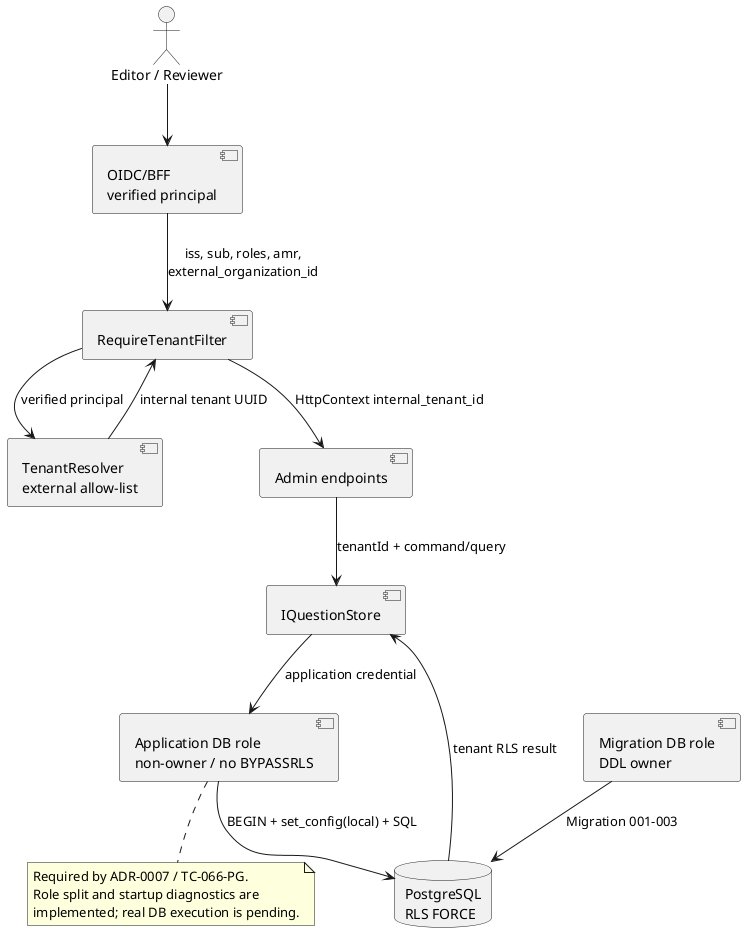
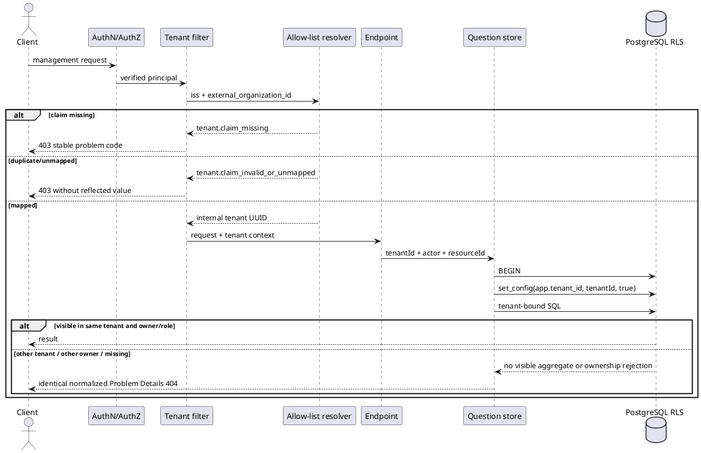
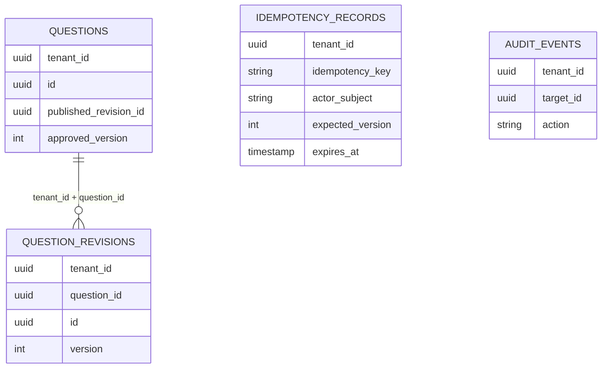
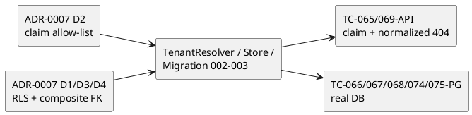
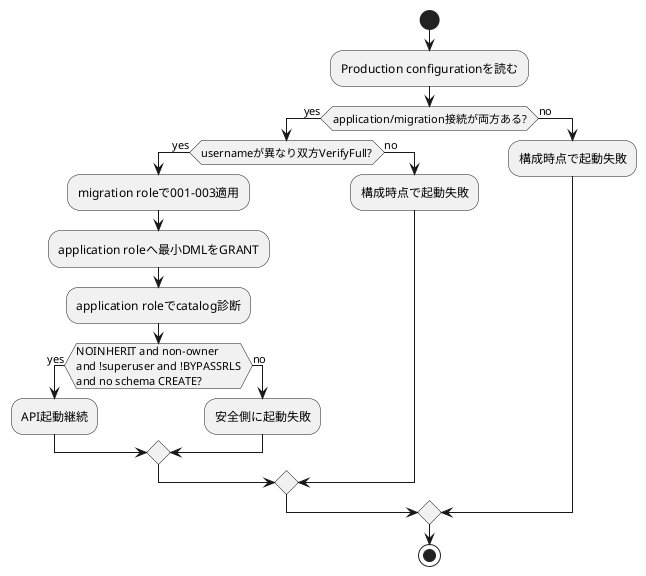
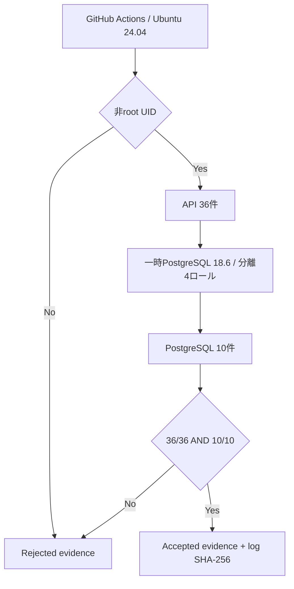

# Stage 6R-4 テナント境界 UML仕様書

- 文書ID: QF-UML-MVS01-6R4
- 版: Version 0.3
- 対応: ADR-0007 D1〜D4、ADR-0008 D5、TC-065〜069/074/075

## コンポーネント

## tenant解決と可視性

## データ制約

`published_revision_id`はrevision ID単独で結ばない。`(tenant_id, question.id, published_revision_id)`から`(tenant_id, question_revisions.question_id, question_revisions.id)`への複合FKで、tenant越境と別question参照を同時に拒否する。

## V字対応

API試験の緑はDB試験の代替ではない。application/migration DBロール分離と起動時診断は実装済みだが、PostgreSQL側5件は実DB未実行のため右側V字は未閉鎖である。

## DBロール起動診断

## 非root CI受入境界

CI構成試験6件はworkflowと証跡判定器の契約を検査するが、右側V字を閉じるのは非root runner上のnative PostgreSQL 10/10だけである。root、模擬実行、件数不足、gate非0の証跡はすべて`rejected`となる。
