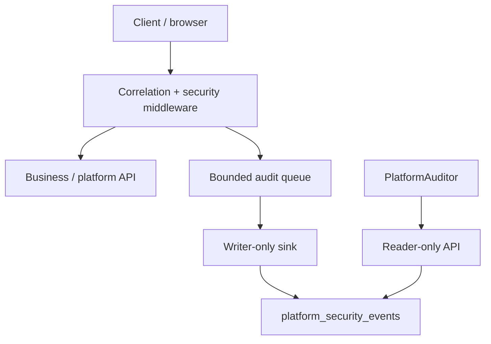
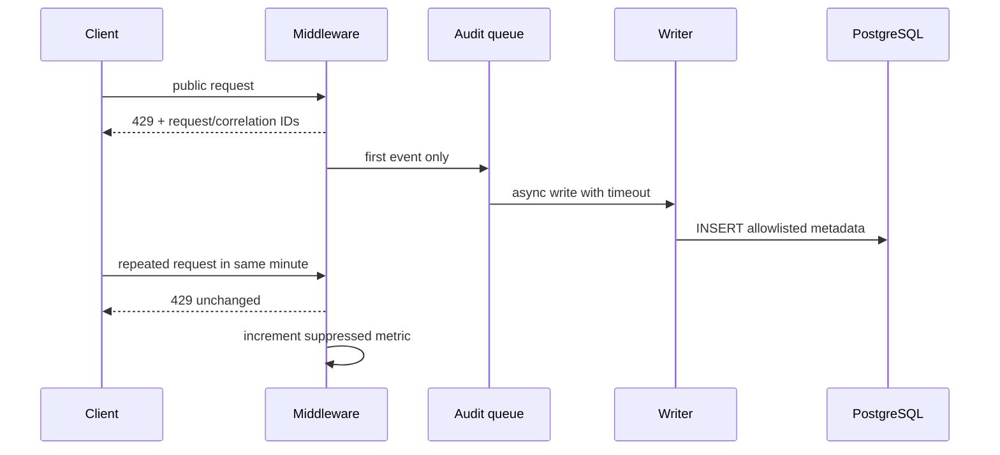
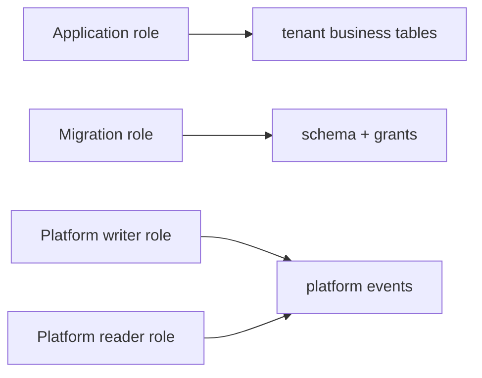
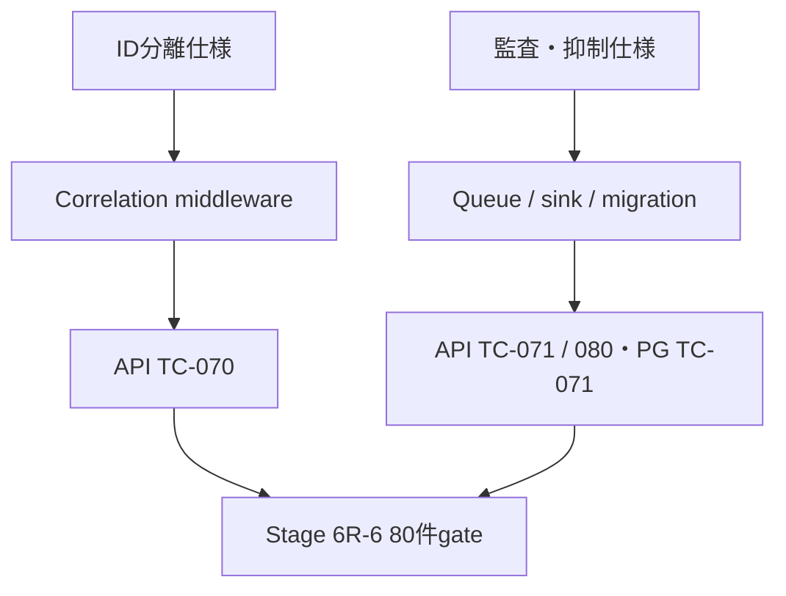

# Stage 6R-6 Platform Security監査 UML仕様書

- 文書ID: QF-UML-MVS01-6R6
- 版: Version 0.1
- 対応仕様: QF-ST6R6-MVS01-001

## Component diagram

tenant Auditorは`audit_events`だけをtenant RLS経由で読み、上図のReaderへ入れない。

## Sequence diagram — 429抑制

## Deployment / credential boundary

application roleからPlatformDBへの経路、およびwriter roleからSELECTへの経路は存在しない。

## V字対応

