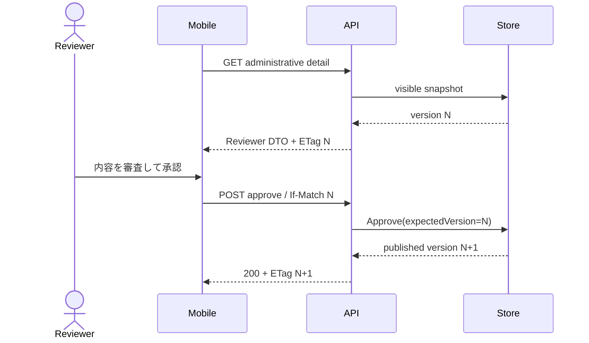
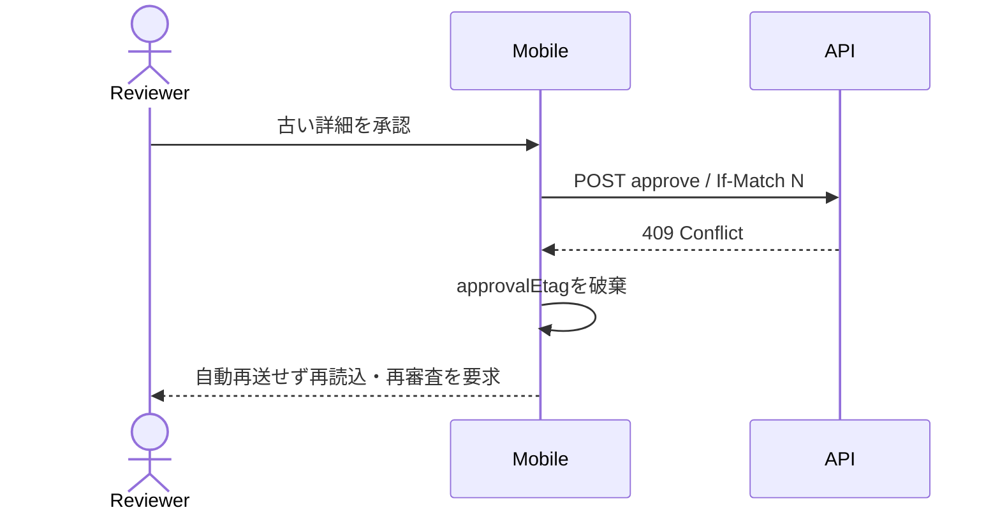
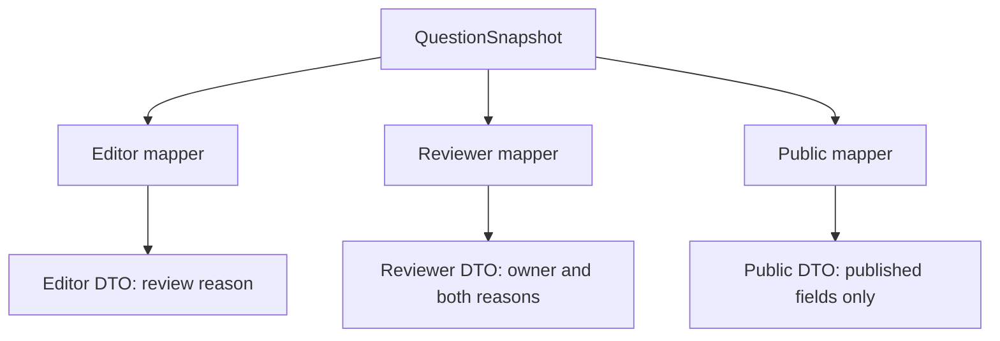

# Stage 6R-8 スマートフォン承認ETag・role別DTO UML仕様書

- 文書ID: QF-UML-MVS01-6R8
- 版: Version 0.1
- 日付: 2026-08-25
- 対応仕様: QF-ST6R8-MVS01-001

## UML-SEQ-MVS01-6R8-001 審査済みETagによる承認

## UML-SEQ-MVS01-6R8-002 競合時の再審査

## UML-CMP-MVS01-6R8-001 role別DTO境界

## UML-TST-MVS01-6R8-001 V字対応

| 左側設計 | 右側試験 |
|---|---|
| 詳細ETag保持・ETagなし承認不可 | TC-ACC-MVS01-076-MOB |
| 409後の自動再送禁止・再審査 | TC-ACC-MVS01-076-MOB |
| Editor DTOのwithdrawalReason非開示 | TC-ACC-MVS01-081-API |
| Reviewer DTOのowner・withdrawalReason許可 | TC-ACC-MVS01-081-API |
| Public DTOの理由非開示 | TC-ACC-MVS01-081-API |
| exact-count全体回帰 | Stage 6R-8非root native 83/83 gate |
