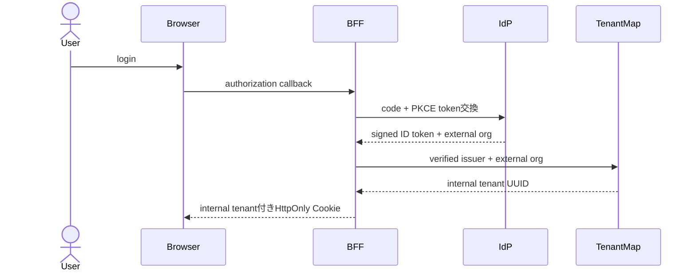
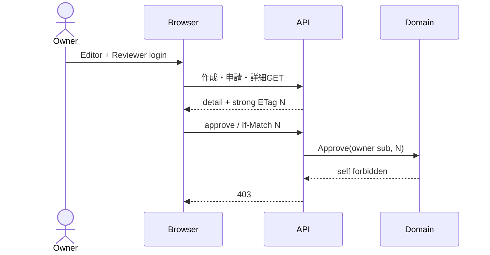
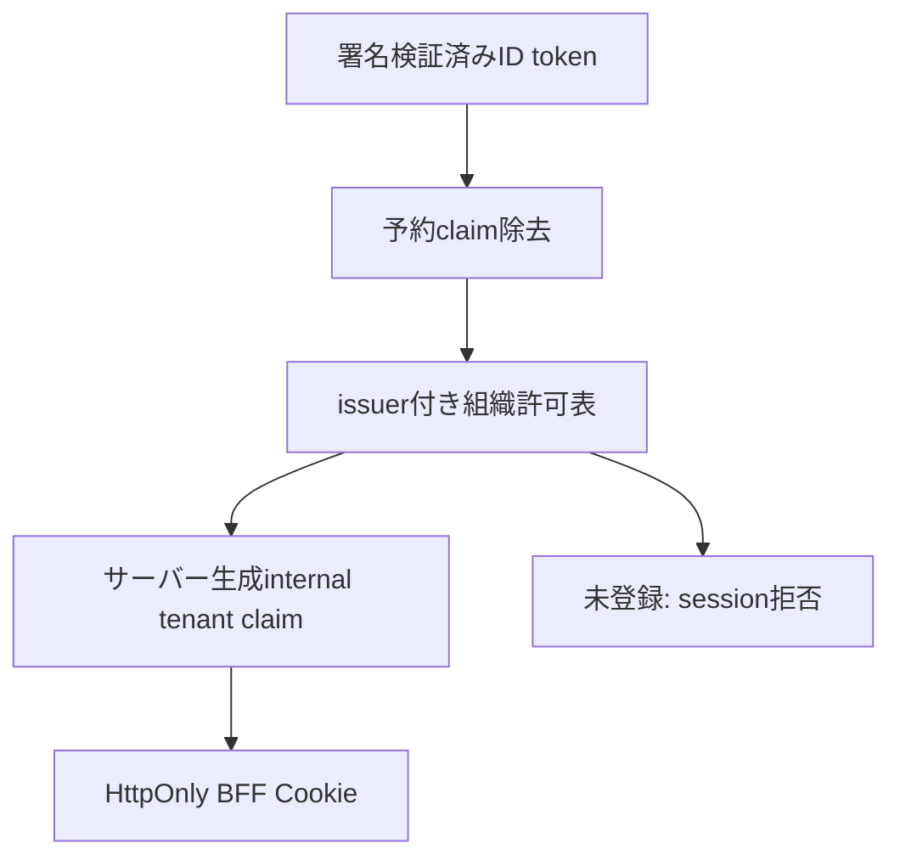

# Stage 6R-9 実OIDC tenant mapping・自己承認境界 UML仕様書

- 文書ID: QF-UML-MVS01-6R9
- 版: Version 0.1
- 日付: 2026-08-25
- 対応仕様: QF-ST6R9-MVS01-001

## UML-SEQ-MVS01-6R9-001 OIDC tenant mapping

未登録組織では`TenantMap`が拒否し、BFFは汎用failureへredirectしてCookieを発行しない。

## UML-SEQ-MVS01-6R9-002 dual-role自己承認拒否

## UML-CMP-MVS01-6R9-001 claim境界

## UML-TST-MVS01-6R9-001 V字対応

| 左側設計 | 右側試験 |
|---|---|
| 署名済み外部組織のissuer付き変換 | TC-ACC-MVS01-077-OIDC |
| 未登録組織のCookie発行前拒否 | TC-ACC-MVS01-077-OIDC |
| 内部tenantへの保存確認 | TC-ACC-MVS01-077-OIDC |
| dual-role strong ETag自己承認403 | TC-ACC-MVS01-077-OIDC |
| 同一tenant・異subject承認200 | TC-ACC-MVS01-077-OIDC |
| exact-count全体回帰 | Stage 6R-9非root native 84/84 gate |
