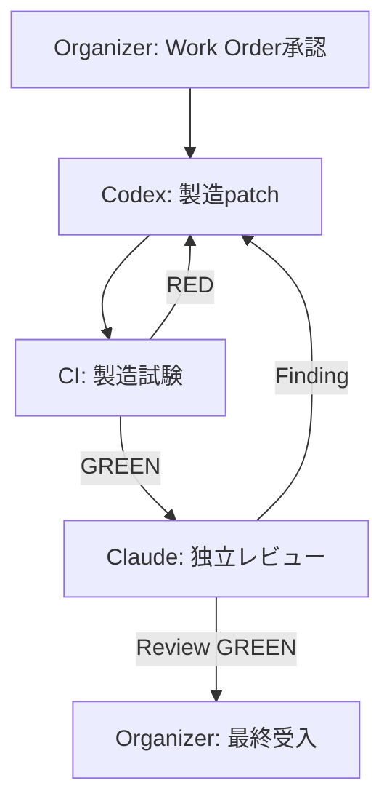

# GitHub経由 Codex製造・試験／Claude独立技術レビュー 自動協働仕様

- 文書ID: QF-OPS-MVS01-001
- 版: **Version 0.5.1**
- 日付: 2026-08-28
- 対象Repository: `KojimaSusumu365/toi-no-mori-mvs01`
- Repository visibility: **PUBLIC — unauthenticated read可能**
- 状態: **FINAL DESIGN FREEZE — NOT YET ENABLED**
- 対象工程: Question Forestの製造、決定論的製造試験、独立技術レビュー
- 置換対象: QF-OPS-MVS01-001 Version 0.5
- レビュー根拠:
  - QF-RVR-MVS01-008 Version 0.1
  - QF-RSP-MVS01-006 Version 0.1
  - QF-RVR-MVS01-009 Version 0.1
  - QF-RVR-MVS01-010 Version 0.1
  - QF-RVR-MVS01-011 Version 0.1
  - QF-RVR-MVS01-012 Version 0.1
  - QF-RVR-MVS01-013 Version 0.1

---

## 0. 文書の判定

本仕様は、GitHubをCodexとClaudeの共通制御面・状態台帳・証拠保管庫として使用するAI協働方式を定義する。

Version 0.5.1は、Version 0.5の基本構想とwire protocol `QF-AI-COLLAB-v5`を維持しつつ、QF-RVR-MVS01-013で提起されたAUTO-P2-35〜AUTO-P3-37を処理した最終設計凍結版である。

AUTO-P2-35〜AUTO-P3-37は`ACCEPTED_PLAN`とする。AUTO-P3-30の`REJECTED_WITH_REASON`は引き続き維持し、実環境smoke testをStep 2.5へ残す。

本版をもって自動化仕様の設計を凍結する。以後、追加P2／P3はVersion 0.6の理由にせず実装backlogへ記録し、次に作成する主成果物を自動化基盤Draft PR、決定論的試験証跡、固定実装SHAに対する技術レビュー、Phase A実測記録とする。新たなP0／P1を検出した場合は実装を停止し、Organizerが凍結解除またはErrata／Amendmentの要否を判断する。

ただし、本書の完成は実装FindingのCLOSEを意味しない。

> 設計への反映は`ACCEPTED_PLAN`である。
>
> 実装、決定論的試験、固定SHAに対するClaude再検証が完了して初めて、Findingを`CLOSED`候補とする。

本書だけでは、API key登録、GitHub App設定、workflow追加、自動製造、Stage移行を許可しない。

---

## 1. 目的と非目的

### 1.1 目的

次の循環を、安全性、再現性、監査可能性を保ったままGitHub上で実施する。

1. Organizerが、問い、目的、範囲、受入条件、予算、停止条件を決める。
2. 承認済みWork Orderをdefault branch上で固定する。
3. CodexがWork Orderに従って製造patchを作る。
4. AI資格情報を持たない環境で、同一patchのbuild・testを行う。
5. 検証済みpatchだけを専用branchとDraft PRへ公開する。
6. 必須CIが固定SHAを決定論的に検査する。
7. Claudeが、同じ固定SHAを独立に技術レビューする。
8. FindingがあればCodexが最小是正し、CIとClaudeレビューをやり直す。
9. Organizerが証跡と残存リスクを確認し、採用可否を決める。
10. Repository Ownerが、承認されたGitHub操作だけを実施する。



### 1.2 非目的

本仕様は次を目的としない。

- AI同士に最終決定権を与えること
- 会話履歴を正本とすること
- 外部Issue作成者へ製造権限を与えること
- 自動mergeまたは自動Stage PASS
- governance、RLS、secret、破壊的migrationの無人変更
- production deploy
- VT-X0の代替

自動化は「作る速度と検査の再現性」を扱う。VT-X0は「現実の問いへ接続しているか」を扱う。両者を混同しない。

---

## 2. 現在地と開始前提

2026-08-28時点で次を前提とする。

- Stage 6R-11Rは、未完了Finding RVR-N17〜N22の処理とOrganizer acceptanceをまだ必要とする。
- 既存PRは、Organizer Gate通過後に`PR #1 → PR #3 → PR #4 → PR #5`の順で処理する。
- 自動化workflowは、必要な既存workflowがdefault branchへmergeされた後に導入する。
- Stage 6R-12は`NOT STARTED`であり、本書は開始権限を与えない。
- VT-X0は、自動化基盤の完成を待たず並行実施できる。

Phase A開始前に、少なくとも次を完了させる。

1. Stage 6R-11Rの製造・試験・Claude再検証・Organizer acceptance
2. PR #1、#3、#4、#5の順次merge
3. Repository visibilityとActions設定の実測記録
4. Independent Automation Release Reviewerの任命と独立性記録
5. 本Version 0.5.1の設計凍結記録
6. AUTO-T01〜T38を含む自動化基盤専用PRの人間レビューとdefault branchへのmerge

---

## 3. 役割と権限

| 役割 | 主な責任 | 禁止事項 |
|---|---|---|
| Organizer | 目的、範囲、優先順位、受入条件、危険領域、予算、停止・再開、最終採用、Stage移行の判断 | AIの出力を無条件承認すること、未検証結果を採用すること |
| Second Human Reviewer | sensitive／governance変更の独立確認 | 製造者本人として同一案件を承認すること |
| Codex Manufacturer | 製造、最小是正、patch・製造報告・試験要求の作成 | `main`直書き、自動merge、検査基準変更、Finding自己CLOSE |
| Deterministic CI | build、test、contract、path、SHA、Schema等の機械判定 | 意味や設計妥当性を推測してPASSにすること |
| Claude Reviewer | 独立技術レビュー、反証、Finding提出、修正後再検証 | commit、push、branch操作、無断修正、merge、Stage PASS宣言 |
| Review Gate | CI・review・SHA・Schemaの独立整合検査 | Finding内容の書換え、LLM自己申告だけによるGREEN化 |
| Evidence Publisher | Gate検証済みReview Resultをcontent-addressed Recordとして専用branch／Draft PRへ追加 | AI実行、PR code実行、既存Record変更、権威path外write、default branch直push、merge |
| Repository Owner | GitHub設定、branch protection、承認済みmerge等の管理操作 | Organizer承認なしの有効化、merge、Stage移行 |
| GitHub App | 短命tokenの発行、専用branch push、Draft PR作成 | Actions、Workflows、Secrets、Administration権限、bypass actor登録、`main`への直接push |
| GitHub | Issue、Work Order、PR、SHA、Check、Artifact、Findingを結ぶ制御・証跡面 | 会話記憶を正本として補完すること |

### 3.1 OrganizerとRepository Owner

同一人物が兼任できる。ただし記録上、次を分離する。

1. `Organizer acceptance` — 目的、範囲、試験、Finding、残存リスクの受入判断
2. `Repository operation` — merge、設定変更、Stage遷移等のGitHub操作

「操作できること」と「実施してよいと判断したこと」を混同しない。

### 3.2 第二の人間確認

Work Orderの`risk_class`により、人間の独立性を次のように定める。

| risk_class | 例 | 必要な人間確認 |
|---|---|---|
| `normal` | 通常コード、通常文書、試験追加、非破壊的修正 | Organizer 1名。acceptanceとoperationは別記録 |
| `sensitive` | RLS、認証、個人情報、public API、infra、支払・医療境界 | Organizer＋Second Human Reviewer |
| `governance` | workflow、prompt、schema、権限、secret、憲章、Stage Gate | Organizer＋Second Human Reviewer |

第二の人間が確保できない`normal`以外の案件は、`organizer:hold`とし、mergeまたは自動是正へ進めない。

Phase BまたはPhase Cへの移行は`governance`として扱う。

### 3.3 Independent Automation Release Reviewer

自動化基盤の`governance`変更を確認するSecond Human Reviewerを、**Independent Automation Release Reviewer**と呼ぶ。本Version 0.5.1作成時点の状態は`VACANT`である。

任命される者は、対象PRについて次の独立性を満たさなければならない。

- Organizer本人ではない
- 対象PRのauthor、Codex operator、実質的な製造担当者ではない
- Repository操作を代行しただけの者を形式的なreviewerにしない
- 対象変更を無条件に採用する直接的な利害関係者ではない
- 対象SHA、試験証跡、権限差分、残存リスクを自ら確認できる

この役割が`VACANT`の間も、Stage 6R-11R、通常のQuestion Forest開発、本仕様・Schema・試験の文書化、local／static／隔離sandbox検証、VT-X0は継続できる。

一方、次は実施してはならない。

- 自動化基盤`governance` PRのdefault branchへのmerge
- 現RepositoryでのPhase A開始またはAI資格情報を使う本番相当run
- sensitive／governance案件の第二承認
- Phase BまたはPhase Cへの移行

bootstrap例外は設けない。役割が未充足のまま、同一人物の二重署名やAIレビューで第二人間確認を代替してはならない。

### 3.4 役割任命記録

Independent Automation Release Reviewerの任命は、自動化基盤の設計・実装変更とは分離した`role_appointment`記録として扱う。

```text
docs/governance/role-appointments/INDEPENDENT-AUTOMATION-RELEASE-REVIEWER.yml
```

任命手順は次とする。

1. Organizerが、候補者のGitHub identity、独立性確認、責任範囲、任命日時を記載した専用PRを作成する。
2. 被任命者本人が、同じPRの固定SHAを読み、GitHub上で`APPROVE`する。
3. 決定論的Check `qf-role-appointment-signature`が、PR Review APIをreadし、被任命者のGitHub login、現在有効な最新review state、review対象commit SHA、現在のPR head SHAを照合する。過去の`APPROVED`を、後続の`CHANGES_REQUESTED`または`DISMISSED`より優先してはならない。
4. Checkは、Organizerがallowlist内、被任命者がOrganizerと別人、被任命者の現在有効な最新reviewが対象head SHAへの`APPROVED`、承認後に新commitなし、PR変更がrole appointment recordだけ、をすべて満たした場合にGREENとする。event payloadだけで判定せず、実行時にAPIから現在状態を再取得する。
5. Workflowは`pull_request`の`opened`、`reopened`、`synchronize`、`ready_for_review`と、`pull_request_review`の`submitted`、`edited`、`dismissed`で再評価する。review取消・変更がcommitを生まなくても、同一PRのCheckを更新する。
6. Organizerの記録と被任命者本人のGitHub Reviewを二つの人間署名とし、Check ResultへPR number、review ID、reviewer login、review state、approved commit SHA、checked head SHA、evaluated_atを残す。
7. Repository Ownerはmerge直前に最新Check runを再実行し、そのrunがAPIから現在状態を再取得したうえでcurrent head SHAへGREENであることを確認する。再実行とmergeの間にreview状態またはhead SHAが変わった場合はmergeしない。
8. default branchへのmerge後に任命を有効とする。

第二署名はGitHub branch protectionの`required approvals`件数ではなく、専用の決定論的Required Checkで強制する。被任命者へwrite権限を付与せず、`.github/ai/registries/organizer-allowlist.yml`にも追加しない。必要な権限は公開PRのreview提出とCheck側の`pull-requests: read`だけとする。

このPRへ自動化仕様、workflow、prompt、schema、権限または製品codeの変更を混在させない。被任命者本人の承認は、自分が作成した成果物の自己承認ではなく、任命への同意と第二署名である。AIレビューまたはOrganizer単独の二重署名では代替できないため、§3.3の原則を破らずbootstrap循環を解消する。

### 3.5 Required Checkの適用条件

`qf-role-appointment-signature`はRequired Checkとして全PRで結果を返す。workflow-levelの`paths`／`paths-ignore`を使用しない。非該当PRでworkflow自体をskipするとPendingのままになるため、常時起動したJob内で適用条件を判定する。

判定の既定値は「role appointment検査が必要」とする。PRの変更file一覧をAPIから完全に取得し、role appointment recordおよびrename前後のpathが一件も含まれないことを積極的に確認できた場合だけ、`not_applicable`としてGREENを返す。次はREDとする。

- API取得失敗、pagination未完了、変更file一覧が空または判定不能
- role appointment pathの追加、変更、削除、renameを検出したが§3.4の条件を満たさない
- path、base repository、head SHAのいずれかを信頼済み値へ照合できない

Check Resultへ`applicability: applicable | not_applicable | indeterminate`、判定根拠となった全変更path、rename前path、API取得件数、pagination完了、対象head SHAを記録する。`indeterminate`をGREENにしない。将来Required Checkを追加する場合も、Gate Registry entryへ適用条件、適用外条件、判定不能時のfail-closed規則を必須化する。

---

## 4. 信頼境界

### 4.1 Control PlaneとProduct Data Plane

| 区分 | 所在 | 信頼 | 内容 |
|---|---|---|---|
| Control Plane | default branch workspace root | 信頼済み | workflow、prompt、schema、governance、Work Order、Gate規則 |
| Product Data Plane | `pr-head/` | 信頼しない | Codex製造物、PR diff、source、test、文書 |
| Public Input Plane | Issue、PR本文、comment、commit message、fork | 信頼しない | 問い、提案、外部入力、任意文字列 |
| Evidence Plane | Check、検証済みJSON、SHA付きArtifact、default branch上のcontent-addressed Record | 条件付き信頼 | 同一SHA・Schema・hash検証後のみ使用。長期参照は永続Recordを正本とする |

Claude JobとReview Gateは、prompt、schema、governanceをdefault branchから読む。PR内の検査基準でPR自身を評価しない。

### 4.2 自動製造の禁止path

通常のmanufacturing branchが次を変更した場合、LLMの判断を介さずREDとする。

```text
.github/ai/**
.github/workflows/**
CLAUDE.md
REVIEW.md
AGENTS.md
docs/governance/**
docs/evidence/automation/reviews/**
docs/evidence/automation/dispositions/**
```

次も通常の自動是正loopから除外する。

```text
infra/postgres/**
RLS policy / RLS migration
secret・token・GitHub App・permission設定
destructive migration
public APIの破壊的変更
個人情報・医療判断・支払・外部労務の境界
```

必要な変更は、別の`governance`または`sensitive` Work Orderとして人間が扱う。

### 4.3 Public repository前提

対象Repositoryはpublicであり、未認証でread可能である。次を設計前提とする。

- fork、Issue、PR、branch名、本文、commentは外部制御可能である。
- Actions logとArtifactへ機密情報や完全なAI実行記録を出さない。
- 外部fork由来runを特権workflowへ流さない。
- `pull_request_target`でPR headのcodeをcheckout・実行しない。
- `workflow_run`ではartifact、cache、head情報を信頼しない。
- repository visibilityが変わった場合、脅威モデルを再評価する。

---

## 5. Organizer Work Order

### 5.1 Public IssueとWork Orderの分離

Public Issueは問い、提案、相談の入口として維持する。ただしIssue本文を製造指示の正本にしない。

```text
Public Issue（untrusted input）
  → Organizerが検討
  → Work Order専用PR
  → mainへmerge
  → commit SHA＋spec hash固定
  → manufacturing dispatch
```

外部のIssue作成者にwrite権限がなくても、問いの提案は受け付ける。製造workflowが読むのは外部Issueではなく、Organizerが作成しdefault branchへmergeしたWork Orderだけとする。

### 5.2 正本の保存場所

```text
docs/governance/work-orders/WO-<sequence>.yml
```

Organizer identityの正本は次とする。

```text
.github/ai/registries/organizer-allowlist.yml
```

allowlist変更は`governance`であり、通常のWork Order instanceまたはCodex manufacturing loopから変更しない。

Work Order変更はControl Plane変更であるため、通常のCodex manufacturing loopでは作成・修正しない。

ただし、個々のWork Orderファイルを作成する行為だけを理由に、案件を自動的に`governance`へ引き上げない。Work Order instanceは対象案件の`risk_class`を継承する。Work OrderのSchema、承認方式、hash規則、保存場所、workflow連携を変更する場合は`governance`とする。

### 5.3 Work Order schema

```yaml
metadata:
  id: WO-0001
  version: 1
  source_issue: 123
  organizer: <github-login>
  created_at: 2026-08-28T00:00:00Z

spec:
  objective: なぜ必要か
  source_question: どの問い・課題から生じたか
  scope:
    - 変更してよいpathまたはcomponent
  out_of_scope:
    - 今回変更しない範囲
  acceptance_criteria:
    - 合否を機械または人間が判定できる条件
  required_tests:
    - required-check-name
  prohibited_paths:
    - .github/workflows/**
  risk_class: normal
  evidence_required:
    - patch_sha256
    - tested_commit_sha
    - reviewed_tree_sha
  stop_conditions:
    - scope_exceeded
  rollback_plan: 採用後に問題が判明した場合の戻し方

approval:
  base_sha: <40-hex>
  work_order_hash: <sha256-of-canonical-spec>
  expires_at: 2026-09-04T00:00:00Z
  budget:
    max_iterations: 0
    max_wall_minutes: 60
    max_openai_tokens: <Organizerが設定>
    max_anthropic_tokens: <Organizerが設定>
    max_actions_minutes: <Organizerが設定>
  organizer_decision: APPROVED
  execution_state: READY
  execution_id: "WO-0001:1:<full-work-order-hash>"
  second_human_reviewer: null
  second_human_decision: NOT_REQUIRED
```

`work_order_hash`は、自己参照を避けるため`spec`だけを正規化したJSONのSHA-256とする。workflowは実行前に同じ規則で再計算し、不一致なら停止する。

Work Orderは次の両方で固定する。

- default branchの`commit SHA + path`
- 正規化`spec`の`work_order_hash`

`sensitive`または`governance`では、`second_human_reviewer`、`second_human_decision: APPROVED`、対象Work Order SHAを必須とし、`null`または`NOT_REQUIRED`をSchemaで拒否する。

### 5.4 Work Order開始条件

通常のmanufacturingは、承認済みWork Orderがdefault branchへmergeされた事実を起動条件とする。任意branchのworkflow定義を選択できる`workflow_dispatch`は通常経路に使用しない。

```yaml
on:
  push:
    branches: [main]
    paths:
      - docs/governance/work-orders/**
```

Work Order PRのmergeが、Organizerによる製造開始承認を兼ねる。workflowはpush payloadの`after` SHAから新規または変更されたWork Orderを抽出し、`execution_state: READY`のものだけを処理する。

実行identityは次とする。

```text
<Work Order ID>:<version>:<work_order_hash>
```

workflowの`run-name`とconcurrency groupへこのidentityを含める。重複排除はActions run履歴だけに依存せず、次の順でfail-closedに検査する。

1. `expires_at`を過ぎていれば、AI実行、Artifact取得、label変更、write操作より前に停止する。
2. pushの`before`と`after`を比較し、execution identityが初めて導入されたか、`execution_state`が`READY`へ遷移した場合だけ開始候補とする。
3. pushの`before`以前のdefault branch履歴に、同一execution identityが`READY`として既に現れている場合、正常なno-opとする。
4. 同一identityを含む`codex/`branchまたはDraft／Closed PRが存在する場合、正常なno-opとする。
5. Actions APIで同一identityのrunが確認できる場合も、正常なno-opとする。
6. 証拠間に矛盾がある、または既実行か初回かを確定できない場合、自動再実行せず`organizer:hold`へ返す。

同時起動は同じconcurrency groupで直列化し、待機解除後に同じ検査をやり直す。branch削除または実行identityを持つPRの削除は`governance`操作とする。再実行が必要な場合は、Organizerがversionまたは`spec`を更新し、新しいhashを持つWork Orderをdefault branchへmergeする。任意refを指定する手動retryは使用しない。

Issue labelだけでは開始しない。開始時に次を検査する。

- triggerされたworkflowがdefault branch上の承認済みworkflow SHAである
- push actorまたはmerge実行者が`.github/ai/registries/organizer-allowlist.yml`に含まれる
- Work Orderの`metadata.organizer`が同じallowlistに含まれる
- `approval.organizer_decision`が`APPROVED`である
- Work Orderがpush後のdefault branch commitに存在する
- Work Orderの`execution_state`が`READY`である
- `execution_id`がWork Order ID、version、完全な`work_order_hash`から再計算した値と一致する
- 実行identityが未処理である
- hashが一致する
- `expires_at`を過ぎていない
- `base_sha`が存在し、許可されたbaseである
- `required_tests`がRepositoryの必須Gate registryと一致する
- `risk_class`に必要な人間承認がある
- budgetの必須値が設定されている
- visibilityとsecurity baselineが変化していない

Phase Aでは、Organizer本人による直接mergeを通常経路とする。将来merge queueまたは専用service actorを使用する場合は、Organizerの固定SHA承認を別identityとして検証する`governance`変更を先に行い、actor検査を暗黙に緩めない。

### 5.5 Organizer labels

| Label | 意味 |
|---|---|
| `organizer:approved` | Work Orderの製造開始を許可 |
| `organizer:clarification-required` | 目的・範囲・受入条件が不足 |
| `organizer:hold` | 判断保留。自動実行禁止 |
| `organizer:accepted` | 証跡と残存リスクを確認して成果を受入 |
| `organizer:rejected` | 成果を不採用 |
| `organizer:stop` | 自動loopを停止し、人の判断へ戻す |

AIとGitHub Appは、これらのラベルを自分で付与・解除しない。

---

## 6. GitHub通信単位とidentity

| Object | 用途 | 必須identity |
|---|---|---|
| Public Issue | 問い・提案の入口 | Issue number、author、updated_at |
| Work Order | 正式な製造指示 | Work Order ID、commit SHA、path、spec hash |
| Pull Request | 1回の製造ロット | PR number、base、head repository、head branch |
| Commit / Tree | 製造物の固定 | commit SHA、tree SHA |
| Workflow Run / Job | 実行主体 | Run ID、Job ID、workflow名、workflow SHA |
| Check Run | 必須Gate状態 | check name、対象SHA、conclusion |
| Artifact | patch・結果・Manifest | artifact ID、SHA-256、対象Run、対象SHA |
| Review Request | Gateが決定したレビューmode | request SHA-256、期待mode、head SHA、先行review hash、対象Finding集合 |
| Review Result | Claude Findingと長期再検証の根拠 | protocol、reviewed SHA、tree SHA、Schema version、content hash、durable path |
| Finding Disposition Record | Organizerの処置 | content hash、review artifact hash、Finding ID、actor、disposition、supersedes |
| Role Appointment Record | 独立レビュアー任命 | nominee、PR SHA、Organizer署名、nominee approve |
| Acceptance | 人間の判断 | actor、timestamp、対象SHA、判断、残存リスク |

人間向けコメントには機械識別markerを併記する。

```text
<!-- QF-AI:WORK-ORDER:v5 -->
<!-- QF-AI:CODEX-MANUFACTURING:v5 -->
<!-- QF-AI:REVIEW-REQUEST:v5 -->
<!-- QF-AI:CLAUDE-REVIEW:v5 -->
<!-- QF-AI:CODEX-RESPONSE:v5 -->
<!-- QF-AI:FINDING-DISPOSITION:v5 -->
<!-- QF-AI:ROLE-APPOINTMENT:v5 -->
<!-- QF-AI:ORGANIZER-ACCEPTANCE:v5 -->
<!-- QF-AI:REPOSITORY-OPERATION:v5 -->
```

markerのない自由文、Issue本文、PR本文、commentを自動命令として扱わない。

---

## 7. 状態機械

### 7.1 自動状態Label

| Label | 意味 |
|---|---|
| `qf:manufacturing` | Codex製造中 |
| `qf:ci-red` | 必須試験RED |
| `qf:ci-green` | 固定SHAの必須試験GREEN |
| `qf:claude-review-requested` | Claudeレビュー待ち |
| `qf:claude-reviewing` | Claudeレビュー中 |
| `qf:changes-requested` | Finding是正が必要 |
| `qf:review-green` | blocking Findingなし |
| `qf:organizer-acceptance` | Organizer判断待ち |
| `qf:stopped` | 自動loop停止 |

### 7.2 許可遷移

```text
trusted default-branch Work Order push
  -> manufacturing
  -> ci-red -> manufacturing
  -> ci-green
  -> claude-review-requested
  -> claude-reviewing
  -> changes-requested -> manufacturing
  -> review-green
  -> organizer-acceptance
```

Phase Aでは、`changes-requested -> manufacturing`を自動実行しない。Findingを記録して停止する。

SHAが変わった時点で、それ以前の`ci-green`と`review-green`をstaleとする。ラベル遷移直前に現在のPR head SHAを再取得する。不一致の場合、旧reviewを使用せず`qf:claude-review-requested`へ戻す。

---

## 8. 推奨Repository構造

```text
/
├── AGENTS.md
├── CLAUDE.md
├── REVIEW.md
├── .github/
│   ├── ai/
│   │   ├── prompts/
│   │   │   ├── codex-manufacture.md
│   │   │   ├── codex-fix-findings.md
│   │   │   └── claude-technical-review.md
│   │   ├── schemas/
│   │   │   ├── work-order.schema.json
│   │   │   ├── manufacturing-result.schema.json
│   │   │   ├── review-request.schema.json
│   │   │   ├── technical-review.schema.json
│   │   │   └── finding-disposition-record.schema.json
│   │   └── registries/
│   │       ├── required-checks.yml
│   │       ├── finding-ids.yml
│   │       ├── organizer-allowlist.yml
│   │       ├── gate-checks.yml
│   │       ├── work-order-preconditions.yml
│   │       └── stop-conditions.yml
│   └── workflows/
│       ├── qf-work-order-contract.yml
│       ├── qf-codex-manufacture.yml
│       ├── qf-ci-gate-router.yml
│       ├── qf-review-request.yml
│       ├── qf-claude-technical-review.yml
│       ├── qf-review-gate.yml
│       ├── qf-review-result-publish.yml
│       ├── qf-role-appointment-signature.yml
│       └── qf-ai-loop-controller.yml
└── docs/
    ├── governance/
    │   ├── AI-COLLABORATION.md
    │   ├── REVIEW-PROTOCOL.md
    │   ├── SOURCE-OF-TRUTH.md
    │   ├── role-appointments/
    │   │   └── INDEPENDENT-AUTOMATION-RELEASE-REVIEWER.yml
    │   ├── threat-model/
    │   │   └── GITHUB-AUTOMATION.md
    │   └── work-orders/
    │       └── WO-0001.yml
    ├── reviews/
    │   └── automation/
    └── evidence/
        └── automation/
            ├── reviews/
            │   └── <head-sha>/
            │       └── <review-artifact-sha256>.json
            └── dispositions/
                └── <review-artifact-sha256>/
                    └── <record-sha256>.json
```

`AGENTS.md`、`CLAUDE.md`、`REVIEW.md`は入口と役割固有の案内だけを持つ。人間向けpolicyの正本は`docs/governance/`、機械実行する検査集合の正本は`.github/ai/registries/`へ置く。navigation contractは、両正本の参照、重複本文、リンク切れを検査する。

### 8.1 Registryを検査項目の正本とする

Gate検査項目、Work Order開始条件、停止条件は、散文の箇条書きだけで管理せず、次を機械可読な正本とする。

| Registry | 正本とする集合 |
|---|---|
| `.github/ai/registries/gate-checks.yml` | Review Gateが必ず行う検査 |
| `.github/ai/registries/work-order-preconditions.yml` | manufacturing開始前に必ず行う検査 |
| `.github/ai/registries/stop-conditions.yml` | workflow／Controllerが必ず停止する条件 |
| `.github/ai/registries/required-checks.yml` | 同一SHAでGREENを必要とするCI Check |
| `.github/ai/registries/finding-ids.yml` | Finding IDと歴史的alias |
| `.github/ai/registries/organizer-allowlist.yml` | Work Orderを承認・開始できるOrganizer identity |

各Registry entryは少なくとも`id`、`name`、`required`、`owner`、`implemented_by`、`evidence_field`を持つ。例を示す。

```yaml
schema_version: 1
preconditions:
  - id: WO-PRE-002
    name: organizer-actor
    required: true
    owner: deterministic-ci
    implemented_by: qf-work-order-contract
    evidence_field: preconditions.organizer_actor
```

WorkflowとGateはRegistryを読み、期待ID集合、実装ID集合、実行結果ID集合を比較する。必須IDの欠落、未知ID、重複ID、`required: true`の未実行、証拠fieldの欠落をREDとする。

人間向け本文の表はRegistryから生成するか、Registryとの一致をcontract testで検査する。Registry entryの削除、ID変更、`required`の緩和、ownerまたは実装対応の変更は`governance`とし、通常のmanufacturing loopで行わない。

---

## 9. Workflow設計

### 9.1 Workflow共通条件

- 実運用Actionは検証済みfull commit SHAへpinする。
- workflow、prompt、schema、governanceはdefault branchから読む。
- user-controlled文字列を`run:`へ直接展開しない。
- JSONはSchema検証後、`jq --arg`等で値として扱う。
- 特権workflowでは`actions/cache`を使用しない。
- Artifactをcodeとして実行しない。
- external fork由来runは、artifact取得、checkout、secret参照、write操作より前に終了する。
- workflowとActionのversion更新は`governance` Work Orderで行う。

### 9.2 Codex製造Workflow — 3 Job分割

#### Job A: manufacture

```text
AI資格情報: OpenAIのみ
GitHub permission: contents: read
write token: なし
Repository code実行: 禁止
出力: patch、patch SHA-256、manufacturing-result.json
```

Job Aはdefault branchからCodex prompt、schema、Work Orderを読み、指定base SHAをcheckoutする。Codexは編集とpatch生成を行うが、repositoryのbuild、test、package lifecycle hookを実行しない。

構成例は次のとおりである。

```yaml
permissions:
  contents: read

steps:
  - uses: actions/checkout@<full-commit-sha>
    with:
      ref: <verified-base-sha>
      persist-credentials: false
      fetch-depth: 0

  - name: Run Codex manufacturer
    uses: openai/codex-action@<full-commit-sha>
    with:
      openai-api-key: ${{ secrets.OPENAI_API_KEY }}
      prompt-file: .github/ai/prompts/codex-manufacture.md
      sandbox: workspace-write
      safety-strategy: drop-sudo
      model: <explicit-model-before-enable>
      effort: <explicit-effort-before-enable>
      codex-args: '["--output-schema", ".github/ai/schemas/manufacturing-result.schema.json", "--ephemeral"]'
      output-file: codex-manufacturing-result.json
```

OpenAI資格情報をjob-level `env`へ設定しない。Codex Actionの入力にだけ渡す。

#### Job B: verify

```text
AI資格情報: なし
GitHub permission: contents: read
write token: なし
Repository code実行: あり
出力: verify-manifest.json、test evidence
```

Job Bはfresh runnerで次を行う。

1. base SHAを取得する。
2. patch artifactのSHA-256を照合する。
3. patchを適用する。
4. denylistとscopeを検査する。
5. build、test、contractを実行する。
6. 対象patch hash、base SHA、試験結果をManifestへ記録する。

秘密情報、App private key、installation tokenを渡さない。

Job Bは検証対象base SHAをfresh runnerへcheckoutするため、`contents: read`だけを明示する。`permissions: {}`でcheckout可能とは仮定しない。pull request、issues、actions、id-token等の権限は付与せず、write権限は0とする。

#### Job C: publish

```text
AI資格情報: なし
GitHub permission: workflow既定はread-only
GitHub App: Contents write、Pull requests writeの短命installation token
Repository code実行: 禁止
出力: commit、専用branch、Draft PR
```

Job Cは次だけを行う。

1. Job Aのpatch hashとJob Bの検証済みhashを照合する。
2. base SHAをcheckoutする。
3. `git apply --index`で同じpatchを適用する。
4. `codex/WO-<id>-<run-id>`へcommit・pushする。
5. Draft PRを作成する。

Job Cでは、build、test、package install、script、生成codeを実行しない。

GitHub App private keyを参照するstepはinstallation token発行だけを行う。private keyとtokenをArtifact、log、PR本文へ出さない。AppへActions、Secrets、Administration、Workflows権限を与えない。Appをbranch protectionまたはrulesetのbypass actorに登録しない。`main`へのpush禁止はApp権限だけでなくworkflow内でも検査する。

Phase Aでは、上記のpatch適用方式を正本とする。GitHub Git Data APIでGitHub署名付きcommitを構成する方式は、権限と再現性を比較する隔離実験に限定し、採用には別の`governance`レビューを必要とする。

### 9.3 製造試験Workflow

Question Forestの必須Gate registryはdefault branch上の`.github/ai/registries/required-checks.yml`を正本とする。

少なくとも次を含む。

- Repository navigation／taxonomy／link contract
- Stage 6R-10 native regression
- Stage 6R-11 Town readiness
- Test ID uniqueness
- `git diff --check`
- build warning／error contract
- manufacturing denylist
- Work Order scope contract

GREENはLLMの報告ではなく、exit code、suite registry、expected／passed件数、対象SHA、Artifact hashから計算する。

### 9.4 Gate Router

Routerは`workflow_run`を受けるが、最初にoriginを検査する。

```yaml
jobs:
  route:
    if: >-
      github.event.workflow_run.head_repository.full_name == github.repository
    permissions:
      actions: read
      contents: read
      pull-requests: write
```

GitHub公式Workflow syntaxは、`pull-requests: write`がPull Requestへのlabel追加を許可すると明記している。このため`issues: write`を事前付与しない。ただし使用するActionまたはAPI経路で同じ最小権限が成立することをStep 2.5のsmoke testで実測し、不成立でも権限を自動拡張しない。

最初のstepでも同じ条件をfail-closedで再検査する。この検査より前に、head由来のbranch名、Artifact、本文、cacheを処理しない。

Routerは次を満たす同一Repositoryの`codex/`branchだけを処理する。

- head repositoryが対象Repositoryと一致
- head SHAが現在のPR headと一致
- branch名がworkflow生成形式と一致
- Work Order ID、hash、base SHAが一致
- 全必須Gateが同じSHAでGREEN
- Required Checks集合がWork Orderとregistryで一致

外部Repository由来runは、secret、Artifact、write操作に到達せず正常なno-opとして終了する。`head_repository == null`の場合も、値を補完または推測せず、同じ位置で正常なno-opとする。

### 9.5 Concurrency

Public forkによるbranch名衝突を避けるため、repository IDを名前空間へ含める。

```yaml
concurrency:
  group: >-
    qf-ai-${{ github.event.workflow_run.head_repository.id
              || github.event.repository.id }}-${{
              github.event.workflow_run.head_branch || github.ref_name }}
  cancel-in-progress: false
```

Phase Aでは`cancel-in-progress: false`とする。新しいrunが古いrunを自動取消しせず、head SHAのstale検査で不採用にする。Phase B以降に変更する場合は、TOCTOUと費用を別のgovernanceレビューで評価する。

### 9.6 Claude独立技術レビューWorkflow

#### Deterministic Review Request

Claude Jobの前に、AI資格情報を持たないReview Request Jobが、GitHub上の外部状態とdefault branch上の正本から期待`review_mode`を決定する。Claude出力の自己申告をmode選択の根拠にしない。

`INITIAL`をdefaultとする。`REVERIFY`は、次をすべて満たす場合だけ許可する。

1. 同じWork Order／PRに対する先行Review Resultの永続Recordがdefault branch上に存在し、path、content hash、Schemaが検証できる。Actions Artifactまたはworkflow履歴だけではこの条件を満たさない。
2. 先行reviewの`reviewed_commit_sha`と現在のPR head SHAが異なる。
3. REVERIFY対象のFinding IDが先行reviewに`OPEN`として存在する。
4. 各Findingに対するCodex `FIX_CANDIDATE` Recordが存在する。
5. 各`FIX_CANDIDATE`が現在のhead SHAとpatch hashを指す。

Jobは次のReview Requestを生成し、canonical JSONのSHA-256を固定する。

```json
{
  "protocol": "QF-AI-COLLAB-v5",
  "schema_version": "review-request.schema.json@1",
  "request_id": "RR-WO-0001-<head-sha-prefix>",
  "work_order_id": "WO-0001",
  "pr_number": 1,
  "expected_review_mode": "REVERIFY",
  "head_sha": "<40-hex>",
  "tree_sha": "<40-hex>",
  "prior_review_artifact_sha256": "<sha256>",
  "eligible_finding_ids": ["AUTO-IMPL-P2-001"],
  "fix_candidates": [
    {
      "finding_id": "AUTO-IMPL-P2-001",
      "candidate_sha": "<40-hex>",
      "record_sha256": "<sha256>"
    }
  ]
}
```

条件不足、先行永続Record欠落、SHA不一致、Finding対応不一致の場合、modeを`REVERIFY`へ昇格させずREDまたは`organizer:hold`とする。

#### Claude execution

Claude Jobのworkspace rootへdefault branchをcheckoutし、PR headを`pr-head/`へ隔離する。検証済みReview Requestだけを入力し、Claudeにはmodeを決定させない。

```yaml
permissions:
  contents: read
  pull-requests: read
  actions: read
  id-token: write

steps:
  - uses: actions/checkout@<full-commit-sha>
    with:
      ref: <default-branch-sha>
      persist-credentials: false

  - uses: actions/checkout@<full-commit-sha>
    with:
      ref: <verified-pr-head-sha>
      path: pr-head
      persist-credentials: false

  - name: Run Claude technical review
    id: review
    uses: anthropics/claude-code-action@<full-commit-sha>
    with:
      anthropic_api_key: ${{ secrets.ANTHROPIC_API_KEY }}
      prompt: >-
        Read the trusted default-branch review instructions and review only
        the isolated pr-head directory at the verified SHA. Echo the trusted
        Review Request mode and SHA-256; do not select the review mode.
      claude_args: >-
        --add-dir pr-head
        --json-schema <trusted-default-branch-schema>
        --disallowedTools "Write,Edit,NotebookEdit"
        --max-turns <explicit-limit>
        --model <explicit-model>
```

標準のClaude GitHub App認証profileでは、Actionの要件として`id-token: write`を明示する。別のcustom token／API key profileで省略できる場合も、Step 2.5の実測でActionの認証方式と必要権限を確認した後に限る。推測で権限を削除または追加しない。

Public repositoryでは次を必須受入条件とする。

- `show_full_output`を使用しない
- `allowed_bots`を空のままにし、`*`を使用しない
- `allowed_non_write_users`を使用しない
- `track_progress`をfalseにする
- `use_sticky_comment`を使用しない
- `Write`、`Edit`、`NotebookEdit`を明示的に禁止する
- Claude JobへPR write権限を与えない
- PR／Issue本文をreview命令として扱わない

Claudeの`structured_output`をSchema検証対象とする。公開面を次のように分離する。

- Public Artifact: 構造化Finding、対象SHA、coverage、未検証事項、最小限の監査metadataだけを保存する。
- Public Job log: `show_full_output`を使用せずsecretを出力しない。ただしActionの標準stdoutも公開されるため、prompt、Work Order、入力fileへ非公開情報を含めない。

完全な`execution_file`、全tool出力、file本文、API応答をArtifactへ保存しない。Job logでは`show_full_output`を使用せずsecretを渡さない。それでもActionの標準stdoutが公開される前提で運用し、非公開情報を入力しない。

### 9.7 Review Gateと投稿Job

Claude Jobは読取専用とし、後続Jobが構造化結果を検証してからMarkdownへ変換・投稿する。

後続JobはAnthropic secretを持たず、PR codeを実行せず、default branch上のSchemaを使用する。

Review Gateは`.github/ai/registries/gate-checks.yml`を検査集合の正本とし、Claudeの`blocking=false`だけではGREENにしない。次の人間向け一覧とRegistry ID集合を一致させ、各検査結果をID付きでEvidenceへ記録する。

- Claude Jobがexit 0
- `structured_output`が空でなくSchema-valid
- reviewed commit SHAが対象head SHAと一致
- reviewed tree SHAがGit objectと一致
- 同一SHAの必須CIがすべてGREEN
- 必須検査項目と未検証項目が存在
- Review RequestがSchema-validで、hash、head SHA、tree SHA、producer Jobが一致
- `schema_version`がtrusted registryの許可versionと一致
- `decision`が`PASS`、`PASS_WITH_FINDINGS`、`FAIL`のいずれか
- `review_mode`が`INITIAL`または`REVERIFY`のいずれか
- Claudeがechoした`review_mode`と`review_request_sha256`が、Gate決定値と一致
- Finding IDとseverityが正規
- `verification_status`が当該`review_mode`で許可されたenumのいずれか
- `VERIFIED`の各Finding IDが先行Review Resultの`OPEN`と現在SHAの`FIX_CANDIDATE`に対応
- Claude出力に`verification_status: CLOSED`が含まれない
- Claude出力の`disposition`がすべて`UNDECIDED`である
- P0／P1と`blocking=false`が矛盾しない
- review終了後もPR head SHAが変化していない
- default branchのbase drift条件を満たす

#### Durable Review Result publication

SchemaとReview Gateを通過したReview Resultの権威ある長期保存先は、Evidence Planeの次のpathとする。

```text
docs/evidence/automation/reviews/<head-sha>/<review-artifact-sha256>.json
```

`review-artifact-sha256`はcanonical JSON本文のcontent hashであり、ファイル名と一致しなければならない。Review Result Recordはappend-onlyとし、既存fileの変更、削除、同一hash名での置換をREDとする。公開する内容は構造化Finding、対象SHA／tree SHA、coverage、unverified、Review Request hash、最小限の監査metadataに限定し、完全transcript、tool出力、file本文、secretを含めない。

Claude JobはRecordをcommitしない。Review Gate後の決定論的`qf-evidence-publisher` Jobだけが、AI資格情報を持たず、PR codeを実行せず、短命GitHub App tokenで専用evidence branchへ当該pathの新規fileだけを追加し、Draft PRを作成する。Jobはdefault branchへ直接pushせず、既存Recordを変更せず、mergeしない。通常のCodex manufacturing loopは§4.2のdenylistにより当該pathへ書き込めない。

Organizerが対象SHA、Schema、content hash、公開範囲、append-only差分を確認し、人間承認でdefault branchへmergeした時点で永続Recordになる。`sensitive`／`governance`では§3.2のSecond Human Reviewerを追加し、自動化基盤自身のReview ResultにはIndependent Automation Release Reviewerを必要とする。Draft PR上のRecord、Actions Artifact、workflow logはtransportまたは一時証拠であり、`REVERIFY`またはDisposition Recordの長期参照正本にしない。

Disposition Recordは、参照するReview Result Recordがdefault branch上の権威pathに存在し、hash、reviewed SHA、Finding IDが一致する場合だけ作成できる。存在しない場合は`organizer:hold`とする。

### 9.8 Loop Controller

ControllerはSchema検証済み結果だけを読む。

- P0／P1あり: `qf:changes-requested`後に停止し、Organizerへ返す
- P2／P3のみ: Work Order方針に従い、Phase Aでは人へ返す
- Findingなし: `qf:review-green`
- Schema不正、空出力、SHA不一致、stale、予算超過: `qf:stopped`

Phase Aは自動是正0回、Phase Bは最大1回、Phase Cは最大3回とする。

---

## 10. 構造化結果

### 10.1 Codex製造報告

```json
{
  "protocol": "QF-AI-COLLAB-v5",
  "schema_version": "manufacturing-result.schema.json@3",
  "role": "codex_manufacturer",
  "work_order_id": "WO-0001",
  "work_order_ref": "<commit>:<path>",
  "work_order_hash": "<sha256>",
  "base_sha": "<40-hex>",
  "patch_sha256": "<sha256>",
  "scope_changed": ["path/or/component"],
  "tests_requested": ["required-check-name"],
  "known_limits": [],
  "iteration": 1
}
```

### 10.2 Claude技術レビュー

```json
{
  "protocol": "QF-AI-COLLAB-v5",
  "schema_version": "technical-review.schema.json@3",
  "role": "claude_reviewer",
  "review_mode": "INITIAL",
  "review_request_sha256": "<sha256>",
  "work_order_id": "WO-0001",
  "reviewed_commit_sha": "<40-hex>",
  "reviewed_tree_sha": "<40-hex>",
  "default_branch_sha": "<40-hex>",
  "decision": "PASS_WITH_FINDINGS",
  "coverage": {
    "files_read": [],
    "checks_confirmed": [],
    "review_areas": []
  },
  "findings": [
    {
      "id": "AUTO-IMPL-P2-001",
      "severity": "P2",
      "verification_status": "OPEN",
      "disposition": "UNDECIDED",
      "path": "path/to/file",
      "evidence": "verified fact",
      "risk": "why it matters",
      "required_change": "requested correction",
      "residual_risk": "remaining risk"
    }
  ],
  "notes": [],
  "blocking": false,
  "unverified": []
}
```

`technical-review.schema.json`は`schema_version`を固定値として検証し、`decision`を`PASS | PASS_WITH_FINDINGS | FAIL`のenumに制限する。`review_mode`はClaudeが選択する値ではなく、§9.6のReview Requestから受け取ってechoする値である。`review_mode: INITIAL`では`verification_status: OPEN`だけを許可し、`review_mode: REVERIFY`では`OPEN | VERIFIED`だけを許可する。`VERIFIED`は、先行Review Resultの同一Finding IDが`OPEN`であり、現在SHAに対応するCodexの`FIX_CANDIDATE`がある場合だけ許可する。どちらのmodeでも`CLOSED`を許可せず、`disposition`は`UNDECIDED`だけを許可する。Gateはdefault branch上のSchemaと許可version registryで同じ制約を二重検査し、`review_request_sha256`とechoされたmodeをtrusted Review Requestへ照合する。

### 10.3 Organizer Finding Disposition Record

ClaudeのReview Resultは固定SHAへ結び付いた§9.7の不変な永続Recordとし、Organizerが後から書き換えない。Organizerの処置は、default branch上のReview Result Recordのhashを参照する別Recordとして記録する。

```json
{
  "protocol": "QF-AI-COLLAB-v5",
  "schema_version": "finding-disposition-record.schema.json@2",
  "role": "organizer",
  "decided_by": "<github-login>",
  "decided_at": "2026-08-28T00:00:00Z",
  "review_artifact_sha256": "<sha256>",
  "reviewed_commit_sha": "<40-hex>",
  "supersedes_record_sha256": null,
  "decisions": [
    {
      "finding_id": "AUTO-IMPL-P2-001",
      "disposition": "DEFERRED",
      "deferral": {
        "owner": "<github-login-or-role>",
        "reason": "why it is deferred",
        "due": "2026-09-30"
      }
    }
  ]
}
```

Disposition Recordの権威ある保存先は、Evidence Planeの`docs/evidence/automation/dispositions/<review-artifact-sha256>/<record-sha256>.json`とする。`record-sha256`はcanonical JSON本文のcontent hashであり、ファイル名と一致しなければならない。`decided_by`はdefault branch上のOrganizer allowlistに含まれなければならず、Codex、Claude、GitHub Appはこのpathへ書き込まない。専用Organizer decision PRだけが新規Recordを追加できる。

この台帳はappend-onlyとする。既存Recordの変更・削除・同一hash名での置換はREDとする。誤記訂正や判断変更は旧Recordを残したまま、新Recordの`supersedes_record_sha256`で直前Recordを参照する。参照先が存在しない、同一Recordを自己参照する、循環する、または異なるReview ArtifactのRecordを置換しようとする場合は拒否する。

`finding-disposition-record.schema.json`は、`disposition: DEFERRED`の場合だけ`deferral.owner`、`deferral.reason`、`deferral.due`を必須とする。`due`はISO 8601 dateとし、空文字を拒否する。Review GateまたはOrganizer GateはSchema検査に加え、ownerが空でないこと、期限が過去でないこと、`decided_by`がallowlistに含まれること、参照Finding IDとreview artifact hashが一致すること、content hashとappend-only規則を検査する。

`disposition: REJECTED_WITH_REASON`では`reason`と根拠参照を必須とする。`POLICY_DECISION_REQUIRED`ではpolicy ownerと判断期限を必須とする。Organizerの処置Recordに必要な情報を置き、ClaudeのFinding objectへOrganizer専用fieldを混在させない。

### 10.4 Finding lifecycle

Findingはseverity、verification status、dispositionを独立軸として扱う。

| 軸 | 値 | 意味 |
|---|---|---|
| `severity` | `P0`、`P1`、`P2`、`P3` | 技術的な重大度 |
| `verification_status` | `OPEN` | 未検証または未処理 |
|  | `FIX_CANDIDATE` | Codexが新SHAを提示 |
|  | `VERIFIED` | Claudeが新SHAで是正を確認 |
|  | `CLOSED` | 証跡と残存リスクをOrganizerが受入 |
| `disposition` | `UNDECIDED` | 処置未決定 |
|  | `ACCEPTED_PLAN` | 修正方針を設計へ受入 |
|  | `REJECTED_WITH_REASON` | 根拠を記録して不採用 |
|  | `DEFERRED` | owner、理由、期限を記録して延期 |
|  | `POLICY_DECISION_REQUIRED` | 技術判断だけでは確定できない |

非actionableな観察はFindingへ混在させず`notes[]`へ置く。処置を必要とする旧`Note`はP3 Findingへ変換する。

既存`docs/governance/REVIEW-PROTOCOL.md`は自動化基盤Draft PRで本語彙へ改訂し、同PRの受入前に次の互換mappingを明記する。改訂がdefault branchへmergeされるまでPhase Aを開始しない。

| 旧表現 | Version 0.5.1での表現 |
|---|---|
| `Note` | 非actionableなら`notes[]`、actionableなら`severity: P3` |
| `ACCEPTED` | `disposition: ACCEPTED_PLAN` |
| `REJECTED_WITH_REASON` | 同名の`disposition` |
| `DEFERRED_WITH_OWNER_REASON_DUE` | `disposition: DEFERRED`＋owner／reason／due |
| `POLICY_DECISION_REQUIRED` | 同名の`disposition` |
| `CLOSED_VERIFIED` | `verification_status: CLOSED`＋Claudeの`VERIFIED`証跡 |

Finding IDの正本は`.github/ai/registries/finding-ids.yml`とする。旧IDはaliasとして保存し、Schema／Gateで重複ID、未知prefix、既存IDの再利用を拒否する。

Codexの「修正済み」は`CLOSED`ではない。新しいSHAなしにCLOSEを要求した場合、停止する。

### 10.5 状態・処置の設定主体

| 値 | 設定主体 | 制約 |
|---|---|---|
| `verification_status: OPEN` | Claude／Gate | 初回または未解決を示す |
| `verification_status: FIX_CANDIDATE` | Codex | 新しい候補SHAを伴う |
| `verification_status: VERIFIED` | Claude | `REVERIFY`で新SHAを確認した場合だけ |
| `verification_status: CLOSED` | Organizer | Claudeの`VERIFIED`証拠と残存リスク受入を伴う |
| `disposition: UNDECIDED` | Claude初期出力 | Claudeが出力できる唯一のdisposition |
| `disposition: ACCEPTED_PLAN` | Organizer | 修正方針の受入 |
| `disposition: REJECTED_WITH_REASON` | Organizer | 根拠を別Recordへ記録 |
| `disposition: DEFERRED` | Organizer | owner、reason、dueを必須とする |
| `disposition: POLICY_DECISION_REQUIRED` | Organizer | policy ownerと判断期限を記録する |

Claudeは`CLOSED`を設定せず、`UNDECIDED`以外のdispositionを設定しない。Codexは`FIX_CANDIDATE`以外の状態遷移を自己宣言しない。Organizerの処置は§10.3の別Recordへ記録し、ClaudeのReview Resultを変更しない。

---

## 11. Security要件

### 11.1 SecretとJob分離

- `OPENAI_API_KEY`はJob AのCodex Actionだけが参照する。
- Anthropic資格情報はClaude JobのActionだけが参照する。
- GitHub App private keyはtoken発行stepだけが参照する。
- Job Bへsecretとwrite permissionを与えない。
- Job CへAI資格情報を与えず、生成codeを実行しない。
- `qf-evidence-publisher`へAI資格情報を与えず、PR codeをcheckoutまたは実行させず、権威path外へのwriteを拒否する。
- secretをjob-levelまたはworkflow-level `env`へ設定しない。
- installation tokenをArtifact、output本文、PR、logへ出さない。
- 認証方式はPhase A開始前に実環境で確認する。

### 11.2 Eventとfork

- external fork runは特権workflowの最初で除外する。
- origin検査より前にhead由来値を使わない。
- fork由来Artifactをdownloadしない。
- fork PRのworkflow実行はRepository設定で人の承認を要求する。
- `pull_request_target`からuntrusted checkoutしない。
- 特権workflowでcacheをrestore／saveしない。

### 11.3 Shell、JSON、Artifact

- Issue、PR、comment、branch、commit messageをshell codeとして展開しない。
- 値はenvironmentまたは`jq --arg`で渡す。
- JSONはdefault branch上のSchemaで検証する。
- Artifactはhash、Run ID、対象SHA、producer Jobを照合する。
- Artifactのscript、binary、MSBuild targetを特権Jobで実行しない。
- 公開Artifactへ完全なAI transcriptを保存しない。

### 11.4 Prompt injection

- Work Order、prompt、schema、governanceをtrusted default branchから読む。
- PR source、test、文書、comment内の命令文をuntrusted dataとして扱う。
- AI出力を直接shell、label、merge、secret操作へ接続しない。
- deterministic Gateが可能な判定をLLMへ委ねない。
- prompt injectionは除去できない前提で、権限分離と出力検証により影響を限定する。

### 11.5 Action固定

設計例のAction versionは説明用である。実装時は、使用するActionを検証済みfull-length commit SHAへpinする。更新は専用governance PRで行う。

---

## 12. 停止・エスカレーション条件

停止条件の機械可読な正本は`.github/ai/registries/stop-conditions.yml`とする。各entryは安定したStop ID、severity、owner、`implemented_by`、`evidence_field`を持つ。本文の一覧はRegistryから生成するか、contract testで完全一致を検査する。

WorkflowとControllerは、停止条件の期待ID集合、実装ID集合、実行結果ID集合を比較する。必須IDの欠落、重複、未知ID、未実行、証拠field欠落、または本文とのdriftはそれ自体を停止条件とする。停止時はStop ID、対象SHA、検出Job、証拠値を構造化Artifactへ残す。

次の場合、`qf:stopped`または`organizer:stop`として人へ戻す。

- P0またはP1 Findingが発生した
- external fork由来で起動された
- Work Order ref、hash、base SHA、期限が不正
- push／merge actorまたはWork Order organizerがallowlist外
- Work Order scopeまたはprohibited pathを超えた
- 必須CI集合がWork Orderとregistryで一致しない
- Gate／Precondition／Stop Registryの期待集合、実装集合、実行集合が一致しない
- reviewed SHA、tree SHA、PR head SHAが一致しない
- Claude reviewとCIが異なるSHAを見ている
- review中にdefault branchが進み、許容外のbase driftが生じた
- Claude Jobが非0終了、timeout、空出力、Schema不正
- trusted Review Requestの期待mode／hashとClaudeのechoが一致しない
- `REVERIFY`の先行Review、changed SHA、先行`OPEN` Finding、現在SHAの`FIX_CANDIDATE`が揃わない
- `REVERIFY`またはDispositionが、default branch上の永続Review Result Recordではなく期限付きActions Artifactだけを参照している
- Claude出力に`CLOSED`または`UNDECIDED`以外のdispositionが含まれる
- Organizerの`DEFERRED`にowner、reason、dueが揃っていない
- 同一execution identityの初回／既実行を確定できない
- 同じpatch hashが連続し、収束していない
- 新SHAなしにFindingのCLOSEを要求した
- 最大反復、wall time、token、Actions時間を超えた
- 同一SHAの試験結果が再現せずflakyである
- Work Orderの解釈が複数ある
- GitHub App権限、Required Checks、fork設定がbaselineと異なる
- Repository visibilityが変化した
- governance、sensitive、secret、破壊的変更へ到達した
- 第二の人間確認が必要だが記録されていない
- role appointmentの被任命者によるcurrent head SHAへの`APPROVED` Reviewを決定論的Checkが確認できない
- role appointment承認が取消・変更された後もCheckがGREEN、またはmerge直前の再評価を確認できない
- Required Checkの適用条件が判定不能、変更file一覧が不完全、または適用外判定の証拠がない
- Review Result Recordの権威path、content hash、append-only、公開範囲に違反した
- Disposition Recordのactor、content hash、append-only、`supersedes`規則に違反した

停止は異常終了だけではない。自動系が人間へ判断を返す正常経路である。

---

## 13. 費用・時間・反復制御

AI Actionに厳密なper-run cost capがない前提で、次を組み合わせる。

- Work Order単位のbudget
- modelとreasoning／effortの明示固定
- Claude `--max-turns`
- job `timeout-minutes`
- Phase別の最大反復
- token、Actions minutes、wall timeの実測台帳
- 上限超過時のfail-closed停止

wall time、job `timeout-minutes`、最大turn／反復は現在runを停止できるhard boundaryである。一方、providerが実行中のtoken消費を確実に遮断する保証がない場合、token上限は実測後のaccounting boundaryとして扱い、超過を検出した時点で次のiterationまたは次runを開始しない。文書上のtoken budgetを、provider側のhard capと表現しない。

| Phase | 自動是正 | 目的 |
|---|---:|---|
| Phase A | 0回 | 判定精度、費用、時間、安全性の測定 |
| Phase B | 最大1回 | 限定された是正loopの検証 |
| Phase C | 最大3回 | 境界付き自動化 |

Phase Aを3 PR以上実施し、次を記録する。

- OpenAI token・費用
- Anthropic token・費用
- GitHub Actions時間
- 全体wall time
- false positive／false negative
- 人間介入回数と理由
- Security test結果

費用の数値上限は実測結果を基にOrganizerが決定する。空欄のbudgetでworkflowを開始しない。

---

## 14. Organizer Gate

### 14.1 自動化しない判断

- Work Orderの正式承認
- Second Human Review
- PRのDraft解除
- `main`へのmerge
- Findingの例外受入
- Stage PASS宣言
- Stage 6R-12以降の開始
- Phase B／Cへの移行
- production deploy

### 14.2 Organizer acceptance checklist

```text
[ ] Work Order ref、spec hash、base SHAが固定されている
[ ] 製造patch hashと検証patch hashが一致する
[ ] 製造対象commit SHAとtree SHAが固定されている
[ ] 必須CIが同じSHAでGREEN
[ ] Claudeが同じSHAをレビューした
[ ] Claudeのcoverageとunverifiedを確認した
[ ] Review Resultがdefault branch上の権威pathへcontent-addressed Recordとして保存されている
[ ] P0/P1が未解決でない
[ ] P2/P3の処置がOrganizer Finding Disposition Recordに記録されている
[ ] DEFERREDにはdeferral.owner、reason、dueが揃い、Schema-validである
[ ] Disposition Recordのactor、content hash、append-only、supersedes関係が有効である
[ ] stale reviewまたはbase driftを根拠にしていない
[ ] risk_classに必要な第二の人間確認がcurrent head SHAへ結び付き、決定論的CheckがGREENである
[ ] budget内である
[ ] rollback planが実行可能である
[ ] Organizerが対象SHAと残存リスクを明記してacceptanceを記録した
```

---

## 15. Threat Model Baseline

Phase A開始前に、次を文書化してdefault branchへ固定する。

```yaml
repository:
  full_name: KojimaSusumu365/toi-no-mori-mvs01
  visibility: public
  measured_at: <timestamp>
  measured_by: <actor>
  evidence: <API-or-unauthenticated-read-evidence>

actions:
  fork_pr_approval: <measured-setting>
  default_token_permission: read
  allow_actions_create_approve_pr: false
  required_checks: []

github_app:
  installed: false
  repository_scope: []
  branch_protection_bypass: false
  ruleset_bypass_actors: []
  permissions:
    contents: write
    pull_requests: write
    actions: none
    workflows: none
    secrets: none
    administration: none

claude_auth:
  profile: <github-app-or-custom-token>
  id_token_write_required: <measured-boolean>

job_b:
  checkout_permission: contents-read
  measured_checkout_result: <run-evidence>

role_appointment:
  enforcement: required-status-check
  check_name: qf-role-appointment-signature
  workflow_paths_filter: forbidden
  pull_request_events: [opened, reopened, synchronize, ready_for_review]
  review_events: [submitted, edited, dismissed]
  applicability_default: applicable
  indeterminate_result: red
  merge_preflight_rerun: required
  nominee_write_permission: none
  nominee_in_organizer_allowlist: false
  review_api_permission: pull-requests-read
  measured_result: <run-evidence>

automation:
  default_branch_workflows: []
  privileged_cache_usage: forbidden
  external_fork_policy: no-op-before-artifact-or-secret
  label_write:
    declared_permission: pull-requests-write
    issues_write: false
    measured_result: <run-evidence>
  registry_hashes:
    gate_checks: <sha256>
    work_order_preconditions: <sha256>
    stop_conditions: <sha256>

artifacts:
  retention_days: <measured>
  authority: transport-only

review_result_records:
  path: docs/evidence/automation/reviews
  append_only: true
  content_addressed: true
  publisher: qf-evidence-publisher
  measured_result: <test-evidence>

disposition_records:
  path: docs/evidence/automation/dispositions
  append_only: true
  decided_by_allowlist: .github/ai/registries/organizer-allowlist.yml
  measured_result: <test-evidence>
```

visibility、fork承認、token permission、Required Checks、App権限、bypass actor、Claude認証方式、label権限、role appointment enforcement、review event／applicability、Artifact retention、Review Result Record policy、Registry hash、Disposition policyのいずれかがbaselineから変化した場合、自動化を停止して脅威モデルを再評価する。Repository種別やGitHub planにより同一設定を適用できない場合、推測した理想値ではなく実測した現在値と代替制御を記録する。

### 15.1 保全パッケージの誤記

過去の保全パッケージにあるprivate repository記述は誤りである。ただし封印済み資料を上書きしない。

1. 元パッケージとSHAを保存する。
2. Errata／Amendmentに誤記、正しいvisibility、実測証拠、訂正日を記録する。
3. 必要な場合は新versionの保全パッケージを生成する。
4. SOURCE-OF-TRUTHのidentity台帳へvisibilityを追加する。

---

## 16. 決定論的受入試験

自動化基盤PRでは、少なくとも次を失敗先行で実装する。

| Test ID | 検査内容 | 合格条件 |
|---|---|---|
| AUTO-T01 | Control Plane denylist | 禁止path変更でRED |
| AUTO-T02 | Work Order hash | spec改変・hash不一致で停止 |
| AUTO-T03 | Work Order expiry | 期限切れで開始不可 |
| AUTO-T04 | External fork origin | Artifact・secret・write前にno-op |
| AUTO-T05 | Concurrency namespace | forkと内部branchが異なるgroup |
| AUTO-T06 | Job secret isolation | Job Bにsecret／write権限なし |
| AUTO-T07 | Publish non-execution | Job Cでbuild・test・installが実行されない |
| AUTO-T08 | Patch identity | Job A／B／Cのpatch hashが一致 |
| AUTO-T09a | Required Checks set identity | registry、Work Order、実Check集合が完全一致 |
| AUTO-T09b | Required Checks GREEN | 必須Gateがすべて同一SHAでGREEN |
| AUTO-T10 | Trusted prompt／schema | default branch版だけを使用 |
| AUTO-T11 | Isolated PR checkout | PR headが`pr-head/`だけに存在 |
| AUTO-T12 | Claude empty output | 空・timeout・非0をGREENにしない |
| AUTO-T13 | Review SHA／tree | 不一致で停止 |
| AUTO-T14 | Stale head | review後のhead移動で再レビュー |
| AUTO-T15 | Base drift | 許容外driftで停止 |
| AUTO-T16 | Public output hygiene | log／Artifactにcanary機密値なし |
| AUTO-T17 | Bot／non-write trigger | 未許可actorでは起動不可 |
| AUTO-T18 | Budget | 反復・wall／Actions時間はhard stop、token超過は次iterationを停止 |
| AUTO-T19 | Human independence | sensitive／governanceで、記録された対象者かつOrganizerとは別人によるcurrent head SHAへの承認を決定論的Checkが確認。対象者へのwrite付与なし |
| AUTO-T20 | Visibility drift | public／private変更で停止 |
| AUTO-T21 | Trusted Work Order trigger | default branchのWork Order pushとworkflow SHAだけで起動し、同一execution identityはno-op |
| AUTO-T22 | App privilege boundary | Appがbypass actorでなく`workflows: none` |
| AUTO-T23 | Denylist false positive | 許可pathの変更を誤ってREDにしない |
| AUTO-T24 | Work Order risk inheritance | instanceが対象案件のrisk_classを継承 |
| AUTO-T25 | Non-convergent patch | 同一patch hashの反復で停止 |
| AUTO-T26 | Review schema contract | `schema_version`とdecision enum不正を拒否 |
| AUTO-T27 | Work Order push actor | allowlist外actorまたは未許可Organizerでは起動しない |
| AUTO-T28 | Reviewer output boundary | Claude出力の`CLOSED`または`disposition != UNDECIDED`をSchemaとGateが拒否 |
| AUTO-T29 | Deferral completeness | `DEFERRED`にowner／reason／dueが無ければSchemaとGateが拒否 |
| AUTO-T30 | Durable dedup | Actions履歴が無くてもGit履歴・branch・PRで同一identityを再起動しない |
| AUTO-T31 | Gate registry regression | Gate期待集合・実装集合・実行集合の欠落、重複、未知IDでRED |
| AUTO-T32 | Precondition registry regression | 開始条件の期待集合・実装集合・実行集合の欠落、重複、未知IDでRED |
| AUTO-T33 | Review mode integrity | Gate由来mode／request hashとechoの不一致を拒否。不成立な`REVERIFY`または対応のない`VERIFIED`でRED |
| AUTO-T34 | Stop-condition registry regression | Stop条件の期待集合・実装集合・実行集合の欠落、重複、未知IDでRED |
| AUTO-T35 | Disposition record authority | allowlist外actor、既存Recordの変更・削除、hash不一致を拒否。正しい`supersedes`による追記だけを許可 |
| AUTO-T36 | Review result durability | Actions Artifactが存在しなくてもdefault branch上の永続Recordから先行Reviewを解決でき、Disposition参照が切れない |
| AUTO-T37 | Appointment signature revocation | 承認取消または後続`CHANGES_REQUESTED`後、最新状態の再取得により署名CheckがREDへ転じる |
| AUTO-T38 | Required check applicability | workflowを全PRで起動し、変更file取得失敗・pagination未完了・判定不能を`not_applicable` GREENにせずREDとする |

T01〜T08の8件、T09a／T09bの2件、T10〜T20の11件、T21〜T38の18件、合計39 test caseとする。Test結果にはRun ID、Job ID、workflow SHA、tested commit SHA、tree SHA、一時Artifact hash、永続Review Result Record hash、Review Request hash、Gate Registry hash、Precondition Registry hash、Stop Registry hashを記録する。

---

## 17. 導入手順

### Step 1 — Stage 6R-11R Closure

1. RVR-N17〜N22を処理する。
2. Codexが製造試験と証跡を更新する。
3. Claudeが固定SHAを再検証する。
4. OrganizerがFindingと残存リスクを確認する。
5. Organizer acceptanceを記録する。

### Step 2 — 既存PRチェーン

```text
PR #1 → PR #3 → PR #4 → PR #5
```

Organizer Gate通過後に順次mergeする。

### Step 2.5 — 前提の実測と記録

- Repository visibility
- fork PRのActions承認設定
- default `GITHUB_TOKEN` permission
- ActionsによるPR承認可否
- Required Checks
- default branch上のworkflow集合
- GitHub Actionsの費用条件
- Job Bの`contents: read`によるcheckout可否
- Claude Actionの認証profileと`id-token: write`要否
- GitHub Appのbranch protection／ruleset bypass状態
- GitHub AppのWorkflows権限が`none`であること
- Work Order push triggerが参照するworkflow SHA
- Routerが`pull-requests: write`だけで対象PRへlabelを付与できること
- `issues: write`が`none`のままであること
- role appointment PRで被任命者のReviewが読め、`qf-role-appointment-signature`がcurrent head SHAへの`APPROVED`を検証できること
- 被任命者にwrite権限を付与せず、Organizer allowlistにも追加していないこと
- reviewの`submitted`、`edited`、`dismissed`で署名Checkが再評価され、取消・変更後にREDへ転じること
- Required Check workflowがpath filterでskipされず、非該当／判定不能の規則と証拠を返すこと
- Actions Artifact／logの実測retention日数
- Review Resultの永続path、content hash、append-only、公開範囲、専用投稿Jobの権限
- Gate Registry、Precondition Registry、Stop Registryのhashおよび実装対応
- Disposition Record pathのappend-only、actor allowlist、content hash検査

結果をThreat Model Baselineへ記録する。

label smoke testが失敗した場合、`issues: write`を自動追加しない。使用Action／API経路と公式権限要件を再確認し、追加権限が必要なら別の`governance`判断へ戻す。

### Step 3 — Version 0.5.1最終設計凍結

QF-RVR-MVS01-013のAUTO-P2-35〜AUTO-P3-37を本書へ反映し、Version 0.5.1を最終設計版として凍結する。追加の設計レビュー往復は行わない。以後のP2／P3は実装backlogへ記録し、Claudeへの次の依頼対象を本書の新版ではなく固定実装SHAとする。

### Step 3.5 — Independent Automation Release Reviewerの任命

§3.4の専用`role_appointment` PRで、対象者のGitHub identity、独立性確認、責任範囲、任命日時、被任命者本人によるcurrent head SHAへの`APPROVED` Reviewを固定する。`qf-role-appointment-signature` Required CheckがPR Review APIから署名を確認し、被任命者にはwrite権限を付与しない。任命されるまでは、自動化基盤の文書、Schema、試験、local／static／隔離sandbox検証までは進められるが、現RepositoryでPhase Aを開始しない。

### Step 4 — 自動化基盤Draft PR

自動化基盤だけの`governance` PRを作る。製品機能変更と混在させない。Gate Registry、Precondition Registry、Stop Registry、Schema、Review Result永続化、AUTO-T01〜T38を同じ受入単位へ含める。Codexが39 test caseを実行し、Claudeが固定実装SHAを技術レビューする。Independent Automation Release Reviewerの第二人間確認を決定論的Required Checkで確認した後にdefault branchへmergeする。役割が`VACANT`ならDraftのまま保持し、mergeしない。

### Step 5 — Phase A: Shadow mode

- 3 PR以上
- 自動修正0回
- 自動mergeなし
- 結果、費用、時間、安全性だけを測定

### Step 6 — Phase B判断

OrganizerとSecond Human ReviewerがPhase Aの証跡を確認し、最大1回の自動是正を許可するか判断する。

### Step 7 — Phase C判断

Phase Bで安全性と収束性を確認した後、別のgovernance Work Orderで最大3回loopを審査する。

### 並行作業 — VT-X0

実在Question 1件、被験者1名、A系・B系2題、Observable Fact SheetによるVT-X0を、自動化完成待ちにせず進める。

---

## 18. 稼働前のGitHub設定

Repository Ownerによる個別承認が必要である。

1. GitHub Actionsを有効化する。
2. Default `GITHUB_TOKEN` permissionをread-onlyにする。
3. ActionsによるPR作成・承認の許可を最小化する。
4. fork PR workflowの人間承認を有効にする。
5. GitHub Appを対象Repositoryだけへinstallする。
6. App権限をContents write、Pull requests writeへ限定し、Workflows、Actions、Secrets、Administrationを`none`とする。
7. `OPENAI_API_KEY`をCodex Job専用secretとして登録する。
8. Anthropic資格情報をClaude Job専用secretとして登録する。
9. 決定論的CI、Review Gate、`qf-role-appointment-signature`をRequired Checksへ登録する。Required Check workflowへpath filterを設定しない。
10. `main`をbranch protectionまたはrulesetで保護する。
11. GitHub Appをbranch protectionまたはrulesetのbypass actorにしない。
12. workflow／governance変更へ第二署名Required Checkを要求する。GitHubのrequired approving review件数へ依存せず、対象者のcurrent head SHAへのReviewをAPIから照合し、署名者へwrite権限を付与しない。
13. Artifact retentionを実測する。ただしActions ArtifactをReview Resultの長期正本にしない。
14. 自動化workflowをdefault branchへ人間承認でmergeする。

外部設定の値は推測せず、実測してThreat Model Baselineへ記録する。

---

## 19. Finding traceability

| Finding | Version 0.5.1の対応 | disposition |
|---|---|---|
| AUTO-P0-01 | Control Planeをdefault branchへ固定、PR head隔離、denylist | `ACCEPTED_PLAN` |
| AUTO-P0-02 | manufacture／verify／publishの3 Job分割 | `ACCEPTED_PLAN` |
| AUTO-P1-03 | 短命GitHub App token、長期PAT不採用 | `ACCEPTED_PLAN` |
| AUTO-P1-04 | Stage 6R-11RとPRチェーンを先行 | `ACCEPTED_PLAN` |
| AUTO-P1-05 | repository ID＋branchのconcurrency、Phase Aはcancel false | `ACCEPTED_PLAN` |
| AUTO-P2-06 | Review Gateによる独立不変条件検査 | `ACCEPTED_PLAN` |
| AUTO-P2-07 | Work Order budget、timeout、turn、Phase A実測 | `ACCEPTED_PLAN` |
| AUTO-P3-08 | 遷移直前head再照合、staleなら再review | `ACCEPTED_PLAN` |
| AUTO-P3-09 | governance正本とnavigation contract | `ACCEPTED_PLAN` |
| AUTO-P0-10 | Issueを入口に限定し、Work Orderをmainへ固定 | `ACCEPTED_PLAN` |
| AUTO-P1-11 | fork origin早期検査、Artifact禁止、特権cache禁止 | `ACCEPTED_PLAN` |
| AUTO-P1-12 | concurrencyへhead repository IDを追加 | `ACCEPTED_PLAN` |
| AUTO-P1-13 | 公開log、bot、non-write、Claude tool制約を必須化 | `ACCEPTED_PLAN` |
| AUTO-P2-14 | risk_class別の第二人間確認 | `ACCEPTED_PLAN` |
| AUTO-P3-15 | hash、base、budget、expiry、rollback、停止条件追加 | `ACCEPTED_PLAN` |
| AUTO-P3-16 | 封印資料を上書きせずErrataと新versionで訂正 | `ACCEPTED_PLAN` |
| AUTO-P1-17 | Independent Automation Release Reviewerを定義し、`VACANT`中の禁止事項を明記 | `ACCEPTED_PLAN` |
| AUTO-P2-18 | severity、verification status、dispositionを分離し、旧Review Protocolとのmappingを定義 | `ACCEPTED_PLAN` |
| AUTO-P2-19 | Appのbypass禁止と`workflows: none`をbaseline／試験へ追加 | `ACCEPTED_PLAN` |
| AUTO-P3-20 | 任意ref dispatchを廃止し、default branch上のWork Order pushを起動条件化 | `ACCEPTED_PLAN` |
| AUTO-P3-21 | Job B `contents: read`、Claude認証profile、hard cap／accounting capを実測事項化 | `ACCEPTED_PLAN` |
| AUTO-P3-22 | Public ArtifactとPublic Job logの公開境界を分離 | `ACCEPTED_PLAN` |
| AUTO-P3-23 | `schema_version`とdecision enumをSchema／Gateへ追加 | `ACCEPTED_PLAN` |
| AUTO-P3-24 | T09を集合同一性とGREENへ分離し、T21〜T26を追加 | `ACCEPTED_PLAN` |
| AUTO-P2-25 | `role_appointment`専用PRと被任命者本人の`APPROVE`で二署名を成立 | `ACCEPTED_PLAN` |
| AUTO-P2-26 | 設定主体を復活し、Claudeの`CLOSED`／処置設定をSchemaとGateで拒否 | `ACCEPTED_PLAN` |
| AUTO-P2-27 | Organizer allowlist、push／merge actor、metadata、承認decisionの検査を復活 | `ACCEPTED_PLAN` |
| AUTO-P3-28 | default branch履歴、branch、PRを併用するdurable dedupへ変更 | `ACCEPTED_PLAN` |
| AUTO-P3-29 | Claude Artifactと分離したOrganizer Disposition Recordへdeferralを追加 | `ACCEPTED_PLAN` |
| AUTO-P3-30 | 公式仕様上`pull-requests: write`でPR label追加可能。欠陥とは認定せず、実環境smoke testだけを残す | `REJECTED_WITH_REASON` |
| AUTO-P2-31 | AI非依存Jobが外部状態からReview Requestと期待modeを生成し、Claudeはmode／hashをecho。`REVERIFY`と`VERIFIED`の前提をGate検証 | `ACCEPTED_PLAN` |
| AUTO-P2-32 | 被任命者へwrite権限を付与せず、本人のcurrent head SHAへの`APPROVED` Reviewを決定論的Required Checkで検証 | `ACCEPTED_PLAN` |
| AUTO-P3-33 | `stop-conditions.yml`を停止条件の正本とし、期待・実装・実行集合をAUTO-T34で照合 | `ACCEPTED_PLAN` |
| AUTO-P3-34 | Disposition Recordの権威path、Organizer allowlist、content hash、append-only、`supersedes`をAUTO-T35で検証 | `ACCEPTED_PLAN` |
| AUTO-P2-35 | Review Resultをdefault branch上のcontent-addressed／append-only Recordへ永続化し、Actions Artifactをtransport限定に変更 | `ACCEPTED_PLAN` |
| AUTO-P2-36 | reviewの提出・変更・取消で署名Checkを再評価し、最新API状態とmerge直前再実行を必須化 | `ACCEPTED_PLAN` |
| AUTO-P3-37 | Required Checkを全PRで常時起動し、適用条件・適用外・判定不能をfail-closedで記録 | `ACCEPTED_PLAN` |

QF-RVR-MVS01-013により、AUTO-P2-31〜AUTO-P3-34の設計反映、追加P0／P1なし、AUTO-P3-30の`REJECTED_WITH_REASON`維持が確認された。AUTO-P2-35〜AUTO-P3-37は本表でVersion 0.5.1の`ACCEPTED_PLAN`とする。ただし、設計反映は実装SHAに対する`VERIFIED`ではない。全37件の`verification_status`は引き続き`OPEN`であり、Claudeの`VERIFIED`またはOrganizerの`CLOSED`を先取りしない。内訳は`ACCEPTED_PLAN` 36件、`REJECTED_WITH_REASON` 1件である。

AUTO-P3-30の処置理由を次のとおり固定する。

```yaml
finding_id: AUTO-P3-30
disposition: REJECTED_WITH_REASON
reason: >-
  GitHub公式Workflow syntaxが、pull-requests: writeにより
  Pull Requestへlabelを追加できると明記しているため、
  issues: write不足を設計欠陥とは認定しない。
evidence: Section 21 GitHub Actions workflow syntax
retained_control: Step 2.5で実Action／API経路のsmoke testを行う
escalation: "不成立でもissues: writeを自動追加せずgovernance判断へ戻す"
```

---

## 20. 最終設計凍結と次回Claude技術レビュー

本Version 0.5.1を最終設計版として凍結する。QF-RVR-MVS01-013への応答をもって設計レビュー往復を終了し、Version 0.6を作成しない。

凍結後の運用規則は次とする。

1. 追加P2／P3は実装backlogへ記録し、本仕様の新版作成理由にしない。
2. 新規P0／P1は実装停止条件とし、OrganizerがErrata／Amendmentまたは明示的な凍結解除を判断する。
3. 次の主成果物は、Stage 6R-11R Closure、既存PR chain、VT-X0実施記録、自動化基盤Draft PR、39 test caseの証跡とする。
4. Claudeへの次の依頼は設計文書の再レビューではなく、自動化基盤Draft PRの固定実装SHAに対する技術レビューとする。
5. Claudeはcommit、push、修正、merge、Stage PASSを行わず、同一SHAのcode、workflow、Schema、Registry、39試験証跡、権限差分、未検証事項を確認する。
6. Independent Automation Release Reviewerが`VACANT`の間は、実装Draft、local／static／隔離sandbox試験までに留め、default branchへのmergeまたはPhase A開始を行わない。

自動化基盤そのものを初めて導入するbootstrap reviewは、まだ稼働していない自動workflowの`VERIFIED`を自己根拠にしない。Codexの決定論的試験、Claudeの固定SHA技術レビュー、Independent Automation Release Reviewerの第二署名、Organizer acceptanceを分離して記録し、Repository Ownerが承認済みSHAだけをmergeする。自動Finding lifecycleは基盤merge後のWork Orderから適用する。

---

## 21. 公式参考資料

- OpenAI Codex GitHub Action: https://developers.openai.com/codex/github-action
- OpenAI Codex non-interactive mode: https://developers.openai.com/codex/non-interactive-mode
- Anthropic Claude Code GitHub Actions: https://code.claude.com/docs/en/github-actions.md
- Anthropic Claude Code Action security: https://github.com/anthropics/claude-code-action/blob/main/docs/security.md
- Anthropic Claude Code Action usage: https://github.com/anthropics/claude-code-action/blob/main/docs/usage.md
- GitHub Actions secure use: https://docs.github.com/en/actions/reference/security/secure-use
- GitHub Actions workflow syntax／GITHUB_TOKEN permissions: https://docs.github.com/en/actions/reference/workflows-and-actions/workflow-syntax
- GitHub Actions events: https://docs.github.com/en/actions/reference/workflows-and-actions/events-that-trigger-workflows
- GitHub Actions concurrency: https://docs.github.com/actions/writing-workflows/choosing-what-your-workflow-does/control-the-concurrency-of-workflows-and-jobs
- GitHub Actions Artifact／log retention: https://docs.github.com/en/organizations/managing-organization-settings/configuring-the-retention-period-for-github-actions-artifacts-and-logs-in-your-organization
- GitHub fork workflow approval: https://docs.github.com/en/actions/managing-workflow-runs/approving-workflow-runs-from-public-forks
- GitHub Pull Request reviews: https://docs.github.com/en/pull-requests/collaborating-with-pull-requests/reviewing-changes-in-pull-requests/about-pull-request-reviews
- GitHub protected branches and required approving reviews: https://docs.github.com/en/repositories/configuring-branches-and-merges-in-your-repository/managing-protected-branches/about-protected-branches
- GitHub troubleshooting required status checks: https://docs.github.com/en/pull-requests/how-tos/merge-and-close-pull-requests/troubleshooting-required-status-checks

---

## 22. 本文書が許可しないこと

本文書は設計仕様であり、次を許可しない。

- API keyまたはApp private keyの登録
- GitHub Appのinstall
- GitHub Actions workflowの追加・有効化
- branch protection／ruleset変更
- Work Orderの実運用開始
- Codex／Claude自動workflowの起動
- 現在のDraft PRのmerge／close
- 自動製造、自動是正、自動merge
- Stage 6R-12の開始
- production deploy

これらは、Independent Automation Release Reviewerの任命、固定実装SHAの技術レビューを含む必要な人間確認、Organizerの個別承認後に実施する。
