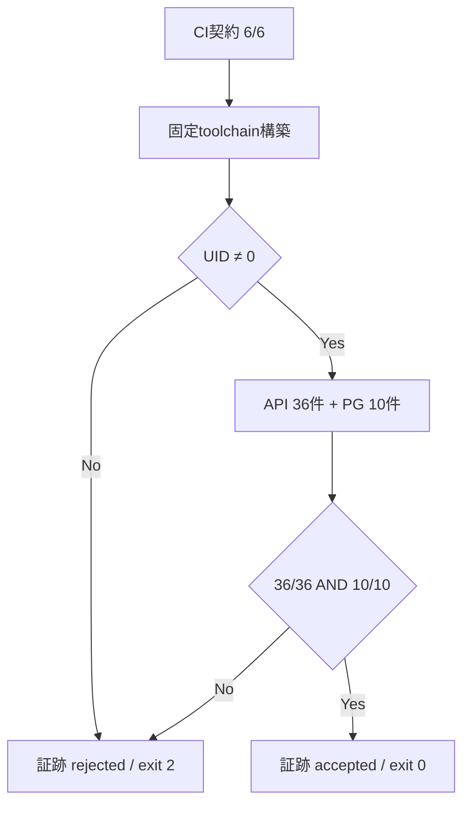

# Stage 6R-4C 非root PostgreSQL CI仕様書

- 文書ID: QF-ST6R4C-MVS01-001
- 版: Version 0.1
- 日付: 2026-08-20
- 対応: ADR-0007 D1/D3、TC-ACC-MVS01-066/067/068/074/075-PG
- 判定: **CI構築済み、GitHub上のnative 10/10実行待ち**

## 1. 目的

Stage 6R-4で実装したDBロール分離を、PostgreSQLをrootで起動できないという製品側の安全条件を維持したまま、再現可能なCIで実測する。API構成試験36件とPostgreSQL実DB試験10件を同じ必須gateで実行し、どちらか一方でも未実行・不足・失敗なら受入を閉じない。

## 2. V字の対

| 左側仕様 | 実装 | 右側の検証 |
|---|---|---|
| 非rootでPostgreSQLを起動する | `.github/workflows/stage6r4c-nonroot-postgresql.yml` | workflow preflightの`id -u != 0` |
| root guardを解除しない | `scripts/ci/run-stage6r4c-db-security-ci.sh` | root時にnative suite未実行・exit 2 |
| DBセキュリティgateを省略しない | `scripts/test-stage6r4-db-security.sh`をそのまま呼ぶ | API 36/36かつPostgreSQL 10/10だけ終了コード0 |
| 証跡を機械判定可能にする | `write-stage6r4c-evidence.py` | suite headingとTAP resultを解析し、件数不足を拒否 |
| CI構成を改ざんしにくくする | read-only権限、action SHA固定、credential非保持 | `test-stage6r4c-ci-contract.sh` 6/6 |

設定試験や合成TAPは、PostgreSQL native試験の代替ではない。証跡の`executionMode=native`、`isSimulated=false`、非root、API 36/36、PostgreSQL 10/10、gate終了コード0が同時に成立した場合だけ受入可能とする。

## 3. CI構成

workflowは`push(main)`、`pull_request`、手動実行で起動する。`pull_request_target`は使用せず、repository権限は`contents: read`だけに限定する。checkout後のcredentialは保持しない。

- runner: `ubuntu-24.04`
- timeout: 45分
- .NET SDK: 10.0.400
- PostgreSQL: 18.6
- toolchain: 公式配布物を固定checksumで検証してproject内へbuild
- NuGet: lock fileをCIのlocked modeで使用
- 外部action: 40桁commit SHAへ固定
- secret: 使用しない
- PostgreSQL: service containerではなく、非root runner所有の一時cluster
- DB role: admin / migration / application / BYPASSRLS拒否試験を分離

キャッシュするのはchecksum検証対象のdownload archiveとlock fileで拘束したNuGet packageである。build済み`.tools`はキャッシュせず、CIごとに検証済みsourceから組み上げる。

## 4. 実行と証跡

```bash
./scripts/test-stage6r4c-ci-contract.sh
./scripts/install-local-toolchain.sh
./scripts/verify-toolchain.sh
./scripts/ci/run-stage6r4c-db-security-ci.sh
```

CIは成否にかかわらず次のartifactを30日保持する。

| ファイル | 内容 |
|---|---|
| `stage6r4c-nonroot-postgresql.log` | build、API、PostgreSQLの連続ログ |
| `stage6r4c-nonroot-postgresql-result.json` | commit、run、runner UID、toolchain、suite件数、判定、log SHA-256 |
| `stage6r4c-nonroot-postgresql-summary.md` | GitHub Actions job summary用の短い判定表 |

ログやJSONへ接続文字列、password、Cookie、tokenを出力しない。試験用DB roleはpasswordなしの一時localhost clusterだけで使用し、job終了時に削除する。

## 5. 実行順序



## 6. 現時点の判定

このWork環境で確認できた範囲は次のとおりである。

- CI構成契約: 6/6合格
- workflow YAML構文: local parserで読込合格
- root失敗閉鎖: native suiteを開始せずexit 2
- Solution Release build: 警告0・エラー0
- API回帰: 36/36合格
- 試験ID一意性: 合格
- GitHub Actions native PostgreSQL: 未実行

したがって、CIファイルの構築は完了したが、Stage 6R-4 DB受入はまだ未完了である。repositoryへ反映後、最初のworkflow runのartifactをレビューし、branch protectionのrequired status checkへ`Native PostgreSQL 10/10 gate`を設定してから10/10を確定する。

## 7. 次gate

1. GitHubへ反映し、native PostgreSQL 10/10の実測証跡を得る。
2. branch protectionでこのjobを必須化する。
3. 分離ロールをDR runnerへ適用し、東京隔離復元4件を再実行する。
4. Stage 6R-5のplatform security auditとAuditor APIへ進む。
