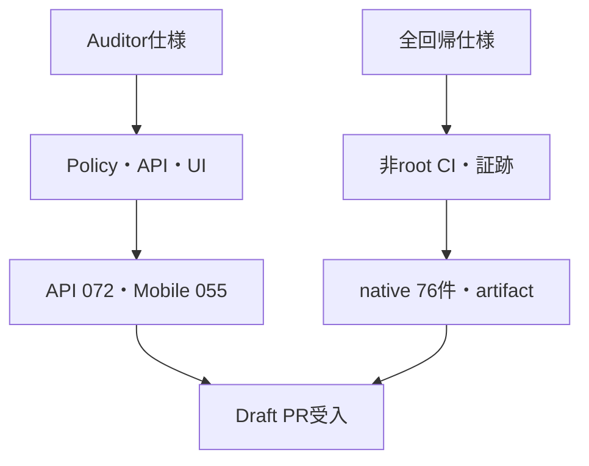

# Stage 6R-5 Draft PR受入・全体回帰仕様書

- 文書ID: QF-ST6R5-MVS01-001
- 版: Version 0.1
- 日付: 2026-08-20
- 対象PR: `stage6r4c-postgresql-green-fix` → `main`
- 判定: **ローカルRED→GREEN完了、GitHub native全76件の証跡待ち**

## 1. 目的と範囲

Stage 6R-4CでGREEN化したPostgreSQL境界を壊さず、Draft PR内の既知RED `TC-ACC-MVS01-055`をAuditor仕様へ合わせて閉じる。同時に、現時点でnative実行可能なDomain/API/Mobile/OIDC/PostgreSQL/DRを一つのfail-closed gateへ統合する。

本gateはDraft PRの受入であり、残存するStage 6R契約、実IdP、物理端末、さくらのクラウド実リージョン切替を合格と読み替えない。

## 2. 失敗先行からGREENまで

| 反復 | 仕様とテスト | 実測 |
|---|---|---|
| RED-1 | `TC-ACC-MVS01-055`: Auditor文字列と専用画面境界がない | Mobile 5/6、全非DB 60/61 |
| RED-2 | `TC-ACC-MVS01-072-API`: Reviewer拒否、Auditor取得、tenant不可視、limit、旧経路廃止 | API 36/37 |
| GREEN | Auditor policy、`/api/ops/audit`、許可リストDTO、UI role分離 | Domain 12/12、API 37/37、Mobile 6/6、OIDC 7/7 |

## 3. 全体回帰受入条件

| Suite | 必須件数 |
|---|---:|
| Domain | 12/12 |
| API | 37/37 |
| Mobile | 6/6 |
| OIDC E2E | 7/7 |
| PostgreSQL実DB | 10/10 |
| 暗号化DR・隔離復元 | 4/4 |
| 合計 | 76/76 |

これに加え、試験ID一意、Release build警告0・エラー0、非root runner、native実行、gate終了コード0をすべて必須とする。合成TAP、未実行、件数不足、root実行をGREENへ数えない。

## 4. セキュリティ受入

- Reviewer roleだけではtenant監査APIを403で拒否する。
- Auditorは許可表で内部tenantを解決し、他tenantの監査を取得できない。
- `limit`は1〜200、既定50とし、旧無制限`/api/admin/audit`を廃止する。
- 応答から内部tenant ID、本文、token、Cookie、secretを除外する。
- API/PostgreSQL/DRのapplication roleは非owner・非rootの境界を維持する。
- DR試験は署名、AES-256-GCM暗号化、改ざん拒否、別DB復元を行うが、クラウドリージョン切替とは表現しない。

## 5. V字対応

## 6. 未完了を分離する項目

- Stage 6R残存failure-first契約10件
- PlatformAuditorと`platform_security_events`
- 実Entra ID、実MFA、iOS/Android実機、screen reader
- 石狩・東京の実リージョン復旧、GSLB切替、PITR
- required status check設定、Draft解除、merge

Draft解除とmergeは本書の自動受入に含めず、明示承認後に行う。
