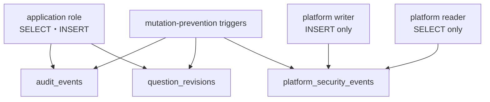
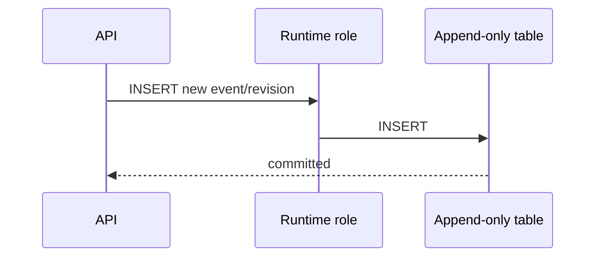

# Stage 6R-7 DB追記専用・改ざん防止 UML仕様書

- 文書ID: QF-UML-MVS01-6R7
- 版: Version 0.1
- 日付: 2026-08-21
- 対応仕様: QF-ST6R7-MVS01-001

## UML-CMP-MVS01-6R7-001 権限と改ざん防止component



通常credentialのGRANTは必要最小限とし、triggerはtable ownerによる通常のUPDATE/DELETE誤操作にも適用する。

## UML-SEQ-MVS01-6R7-001 正常追記



## UML-SEQ-MVS01-6R7-002 改ざん拒否

```mermaid
sequenceDiagram
    participant Actor as Runtime/Migration actor
    participant DB
    participant Trigger as Mutation guard
    Actor->>DB: UPDATE or DELETE existing row
    DB->>Trigger: BEFORE mutation
    Trigger-->>DB: SQLSTATE 55000
    DB-->>Actor: transaction rejected
```

## UML-TST-MVS01-6R7-001 V字対応

| 左側設計 | 右側試験 |
|---|---|
| role別GRANT/REVOKE | TC-ACC-MVS01-073-PG privilege catalog検査 |
| 3 tableのtrigger | TC-ACC-MVS01-073-PG trigger catalog検査 |
| UPDATE/DELETE拒否 | TC-ACC-MVS01-073-PG owner credential実操作 |
| INSERT継続 | TC-ACC-MVS01-073-PG API/writer事前条件 |
| 全体回帰 | Stage 6R-7非root native 81/81 gate |
